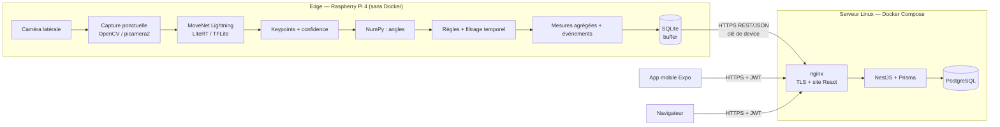
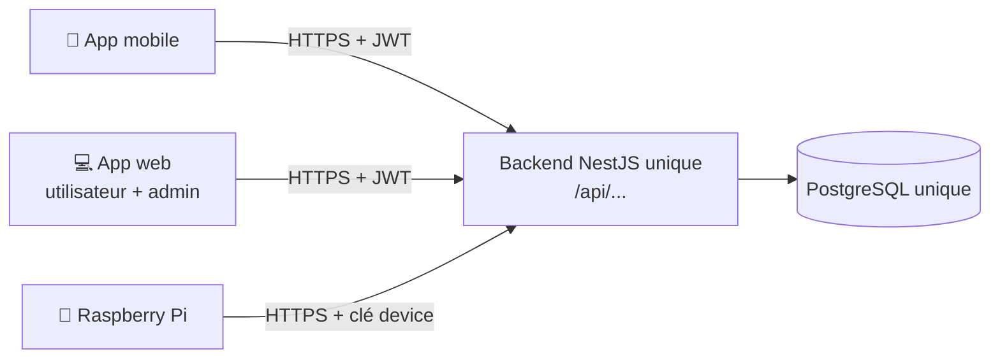
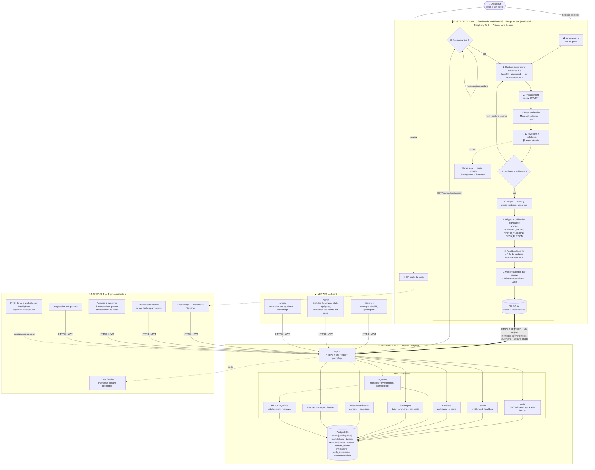
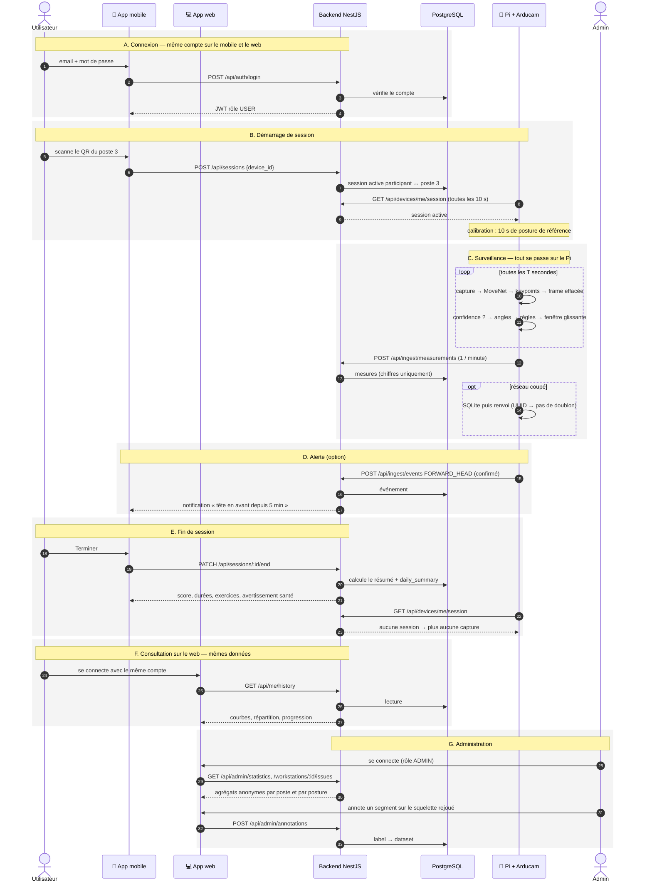
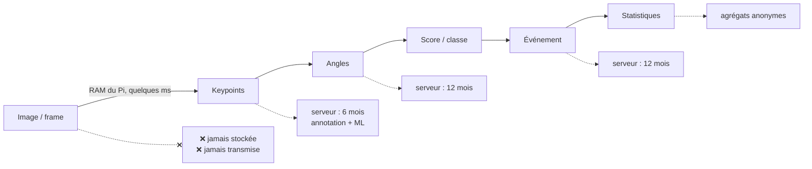
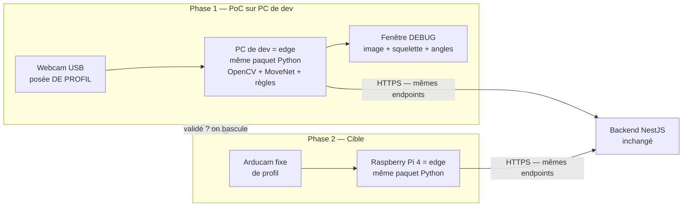
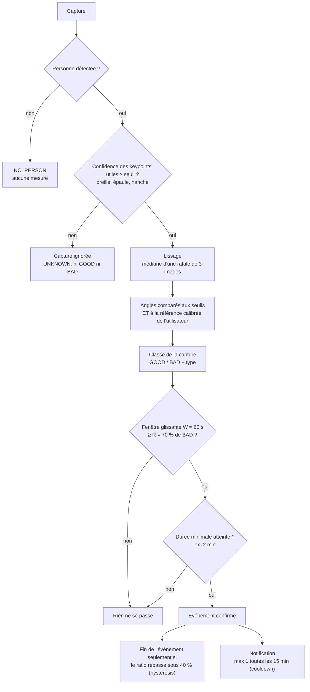
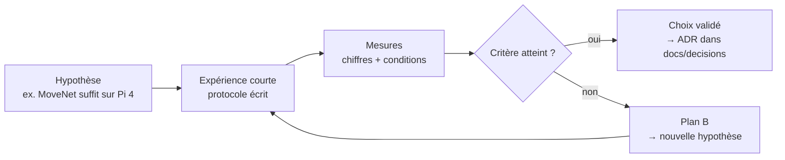

# Audit technique — Fil Rouge Master UHA 4.0 — « Dos d'âne »

> **Version v3** : révision de la v2 après confrontation avec le sujet officiel *Fil rouge Master 2026* et avec le dépôt `dos-d-ane`.
>
> Principaux changements par rapport à la v2 :
> - ajout d'une **matrice de conformité** au sujet (§2) ;
> - **application mobile** remontée dans le MVP, car le sujet lui attribue les fonctions « personne aidée » ;
> - ajout de l'**annotation des données** et de la constitution d'un **dataset**, exigées par le sujet et absentes de la v2 ;
> - **cadence de capture sobre**, alors que la v2 raisonnait en flux vidéo (exigence « développement responsable ») ;
> - **caméra fixe latérale** et postures MVP révisées, car la v2 demandait trois postures impossibles à mesurer avec une seule caméra ;
> - **modèle de données générique** pour le « plug n play » (plusieurs types de capteurs) ;
> - nouvelles sections : appairage utilisateur ↔ poste, sécurité, RGPD détaillé, avertissement santé, risques, objectifs chiffrés, répartition IA, sources académiques ;
> - déploiement aligné sur le dépôt (web conteneurisé, CI/CD) ;
> - schémas de bout en bout (§4), capacité du Raspberry Pi 4 (§5), phase PC puis Raspberry et répartition Pi / serveur (§7), gestion des erreurs de l'IA (§10), squelette animé sur le mobile et le web (§17), plan de validation E1–E17 (§21).
>
> **Statut :** les choix décrits ici sont des **hypothèses argumentées**. Chacun doit être confirmé ou remplacé par les expériences du **§21** (plan E1–E17) avant d'être considéré comme définitif.

---

## 1. Contexte et objectif

Le sujet demande un **POC** de système d'amélioration de la posture pour des personnes en travail sédentaire (développement informatique) dans les locaux d'UHA 4.0. Il mobilise trois domaines : objets connectés, programmation mobile et reconnaissance d'images.

Le **MVP exigé par le sujet** est une interface qui présente à l'utilisateur **des conseils de posture et des exercices**, en indiquant clairement que l'application **ne remplace pas un professionnel de santé**. Un **administrateur** peut visualiser les flux de données et les problèmes les plus fréquents.

Notre groupe se concentre sur :

1. **l'analyse de posture par caméra fixe**, avec un traitement IA embarqué (edge) ;
2. **l'application mobile de la personne aidée** : sessions, conclusions, conseils, progression, et analyse par photo en itération 2 ;
3. **la visualisation et l'annotation côté administrateur** ;
4. **la protection des données** dès la conception (privacy by design).

Les capteurs **TOF et IMU** ne font pas partie de notre périmètre MVP, mais l'architecture est conçue pour les accueillir sans refonte (§11, plug n play).

### Problématique

> **Comment concevoir un système intelligent capable de détecter automatiquement et de manière non intrusive les mauvaises postures d'une personne travaillant devant un ordinateur, tout en minimisant la collecte, le stockage et le transfert de données personnelles ?**

Phrase à retenir pour présenter le projet :

> *La caméra voit la personne, le Raspberry transforme localement l'image en données numériques, l'image disparaît, et seul le résultat est envoyé au serveur.*

### Choix non retenus (et pourquoi)

Le sujet demande de choisir une approche, de l'étudier et de **justifier** ce choix.

| Option | Avantages | Pourquoi elle n'est pas retenue pour le MVP |
|---|---|---|
| **IMU** (portés sur le corps) | données légères, aucune image, mesure continue | il faut **porter ou fixer** des capteurs sur soi : intrusif, contraignant au quotidien, plus d'abandons. La caméra est **transparente** : on s'assoit, on travaille, le système analyse. |
| **Arduino / ESP32** | faible consommation, adapté aux IMU | inutile sans IMU. Le Raspberry suffit pour la caméra et l'inférence. |
| **TOF** | profondeur, moins identifiant qu'une image | matériel à valider, et pas de modèle de pose prêt à l'emploi comparable à MoveNet |
| **Traitement de l'image sur le serveur** | plus de puissance de calcul | transfert d'images contraire aux règles RGPD du sujet (§3) |
| **FastAPI** (au lieu de NestJS) | même langage que l'edge (Python) | NestJS est déjà en place dans le dépôt, avec un typage partagé avec le web et le mobile en TypeScript |
| **MQTT** (au lieu de REST) | conçu pour l'IoT, adapté aux flux continus | à notre cadence (une mesure agrégée par minute), REST/HTTPS suffit, sans broker supplémentaire à opérer. MQTT reste pertinent si on ajoute des IMU en flux continu (§25). |

---

## 2. Matrice de conformité au sujet

Légende : ✅ MVP · 🔁 itération 2 · 🔭 évolution prévue (architecture prête) · ⛔ hors périmètre (justifié)

| Exigence du sujet | Réponse | Statut | § |
|---|---|---|---|
| Analyse de posture par caméra fixe | Raspberry Pi 4 + caméra latérale + MoveNet | ✅ | 5–8 |
| Limiter le nombre de captures | 1 capture toutes les 2 à 5 s, aucun flux vidéo | ✅ | 6 |
| Analyse par photo de téléphone | Photo frontale analysée **sur le téléphone** | 🔁 | 17 |
| Capteurs embarqués du téléphone (poche) | Modèle de mesure générique prêt | 🔭 | 11 |
| Capteur TOF | Modèle de mesure générique prêt | ⛔ / 🔭 | 11 |
| Capteurs IMU | Modèle de mesure générique prêt | ⛔ / 🔭 | 11 |
| Les données ne doivent pas permettre d'identifier | Aucune image stockée ni transmise ; pseudonymes ; vues admin agrégées | ✅ | 14–15 |
| Automatiser le traitement des vidéos | Pipeline entièrement automatique sur l'edge | ✅ | 7 |
| Accès aux données originales restreint | Rôles USER / ADMIN / DEVICE ; table d'identité séparée | ✅ | 14 |
| Favoriser le traitement sans transfert | Edge AI : l'image ne quitte jamais l'appareil | ✅ | 4 |
| Ne pas stocker la donnée brute inutile | Frames en RAM uniquement | ✅ | 12 |
| Admin : historique par capteur | Dashboard admin par device | ✅ | 18 |
| Admin : suivre plusieurs utilisateurs | Sessions utilisateur ↔ poste | ✅ | 13 |
| Admin : **annoter les données** | Outil d'annotation sur la relecture du squelette | ✅ | 16 |
| Admin : problèmes récurrents (matériel inadapté ?) | Agrégation par **poste de travail** | ✅ | 18 |
| Admin : alertes anonymisées | Liste d'alertes sous pseudonyme | ✅ | 18 |
| Mobile : démarrer une session de capture | Démarrage de session et appairage par QR code | ✅ | 13 |
| Mobile : conclusions | Résumé de session | ✅ | 17 |
| Mobile : ressources (articles, exercices) | Recommandations liées au type de posture | ✅ | 17 |
| Mobile : progression au fil des jours | `daily_summaries` | ✅ | 17 |
| Web : données de l'utilisateur | Dashboard personnel React | ✅ | 17 |
| Analyse de postures dynamiques (exercices) | — | 🔭 | 25 |
| Avertissement « ne remplace pas un professionnel de santé » | Affiché sur le web et le mobile (déjà dans le dépôt) | ✅ | 15 |
| Approche plug n play | Enrôlement des devices et mesures génériques | ✅ | 11, 14 |
| Justifier les choix par des sources académiques | Section sources + plan d'expériences | ✅ | 21, 28 |
| Travail réutilisable par de futurs modèles d'IA | Dataset annoté exportable avec sa fiche descriptive | ✅ | 16 |
| Chaque étudiant de 4.0.5 traite un sujet d'IA | Répartition proposée | ✅ | 23 |
| Documentation : choix, blocages, répartition | Expériences, ADR, journal des blocages dans `docs/` | ✅ | 21, 24 |

---

## 3. Écart assumé avec le schéma d'architecture du sujet

Dans le schéma proposé par le sujet, le Raspberry envoie des **photos et vidéos** au serveur, qui héberge l'« IA de détection lourde » puis anonymise et historise.

Nous faisons un choix différent : **l'image ne quitte jamais l'edge**. Ce choix s'appuie sur les exigences RGPD du sujet lui-même :

- « Tout traitement qui peut être réalisé sans transfert de donnée est à favoriser » ;
- « Si la donnée brute n'apporte pas de plus-value, elle ne doit pas être stockée ».

L'architecture reste **hybride**, comme dans le schéma du sujet, mais sur des données dérivées :

| Niveau | Schéma du sujet | Notre implémentation |
|---|---|---|
| Edge | « IA légère, détection de première intention » | Pose estimation (MoveNet), angles, règles, filtrage temporel |
| Serveur | « IA de détection lourde » | **Entraînement** du classifieur ML sur les keypoints annotés (itération 2), réanalyse de l'historique, détection des problèmes récurrents. Le modèle entraîné est ensuite exécuté sur l'edge (§7). |

On transmet ainsi la **représentation squelettique**, et jamais les pixels.

---

## 4. Architecture générale



Principe central :

> **La machine qui possède la caméra analyse l'image localement. Seules des données dérivées (keypoints, angles, scores, événements) sont transmises.**

### Répartition des responsabilités

| Composant | Fait | Ne fait pas |
|---|---|---|
| **Edge** (Pi 4) | capture ponctuelle, pose estimation, angles, règles, filtrage temporel, agrégation, buffer SQLite, envoi, affichage local optionnel | stockage long terme, stockage d'images, statistiques globales |
| **Backend** (NestJS) | authentification, devices, sessions, ingestion, historique, statistiques, recommandations, annotation, export du dataset, relais du squelette en direct, entraînement ML et réanalyse (itération 2) | réception d'images, classification en temps réel |
| **Web** (React) | dashboard personnel, dashboard admin, outil d'annotation | — |
| **Mobile** (Expo) | appairage et démarrage de session, conclusions, conseils et exercices, progression, analyse photo locale (itération 2) | envoi de photos |

### Un seul backend pour tout le monde

**L'app mobile, l'app web et les Raspberry utilisent le même backend NestJS**, donc la même API, la même base PostgreSQL et les mêmes comptes.



Conséquences :

- **un seul compte** : l'utilisateur se connecte avec les mêmes identifiants sur le mobile et le web, et voit les **mêmes données** des deux côtés ;
- **une seule logique métier** : score, statistiques et conseils sont calculés une seule fois, côté serveur, et les deux apps les affichent simplement ;
- **un seul contrat d'API** documenté par Swagger, d'où l'on génère le client TypeScript partagé par le web et le mobile ;
- les droits dépendent du **rôle** dans le JWT (`USER`, `ADMIN`) ou de la **clé de device** (`DEVICE`), pas de l'application utilisée.

### 4.1 Schéma complet de la solution

Traits pleins : MVP. Traits pointillés : itération 2 et options. Les numéros suivent le parcours d'une donnée.



### 4.2 Fonctionnement de bout en bout (mobile + Raspberry + web)

Les phases dans l'ordre :

| Phase | Où | Ce qui se passe |
|---|---|---|
| A. Connexion | mobile et web | même compte, même backend |
| B. Démarrage | mobile → backend → Pi | scan du QR : le Pi apprend qu'une session est active |
| C. Surveillance | Pi | capture, IA, angles, filtrage ; envoi de chiffres uniquement |
| D. Alerte | backend → mobile | notification si une mauvaise posture dure (option) |
| E. Fin de session | mobile | résumé, conseils, exercices |
| F. Consultation | web | historique détaillé de l'utilisateur |
| G. Administration | web admin | statistiques agrégées, problèmes par poste, annotation |



### 4.3 Où se trouve chaque donnée



Plus on avance dans la chaîne, moins la donnée est sensible.

---

## 5. Matériel edge

| Élément | Choix | Remarques |
|---|---|---|
| Carte | **Raspberry Pi 4** (disponible) | Raspberry Pi OS **64 bits (Bookworm)** recommandé, nécessaire pour les wheels aarch64 |
| Caméra | **Arducam** (référence exacte à vérifier, ex. IMX219, connecteur CSI) ; **webcam USB** en phase PC et en plan B | Sous Bookworm, une caméra CSI passe par libcamera, donc **`picamera2`** : `cv2.VideoCapture(0)` ne fonctionne pas directement. Une webcam USB fonctionne avec le même code `cv2.VideoCapture` que sur PC. Le code passe par une abstraction `CameraSource` (`usb` / `picamera2`), validée par l'expérience E2. |
| Horloge | **NTP obligatoire** | Le Pi 4 n'a pas d'horloge à pile : sans NTP, les timestamps des données mises en buffer hors ligne sont faux. |
| Python | **3.11 sur le Pi, même version en dev** | Le dépôt indique Python 3.14 en dev. Les wheels de LiteRT et MediaPipe ne sont pas forcément disponibles pour 3.14 : aligner la version de dev sur celle du Pi pour éviter « ça marche sur mon PC ». |
| Runtime IA | **LiteRT** (`ai-edge-litert`, successeur de `tflite-runtime`) | Vérifier la compatibilité aarch64 / Python 3.11. |

Le développement commence sur PC avant le portage sur le Pi : voir §7, « Phase 1 sur PC, phase 2 sur Raspberry ».

### Le Raspberry Pi 4 peut-il tout faire tourner ?

**Oui, car il ne fait tourner que la partie edge.** Le backend, la base, le web et le mobile sont sur le serveur ou sur le téléphone, pas sur le Pi.

| Tâche sur le Pi | Charge estimée | Commentaire |
|---|---|---|
| Capture d'une image | très faible | une image toutes les T s, pas un flux vidéo |
| MoveNet Lightning (LiteRT, entrée 192×192) | de l'ordre de quelques dizaines de ms à environ 100 ms par image sur CPU ARM (ordre de grandeur des exemples publiés, **à mesurer**) | modèle conçu pour l'embarqué ; à T = 5 s, le CPU est occupé moins de 5 % du temps |
| Angles NumPy, règles, fenêtre glissante | négligeable | quelques calculs vectoriels |
| SQLite (buffer) | négligeable | quelques Ko par heure |
| Envoi HTTPS | négligeable | une requête par minute |
| Mode DEBUG avec affichage en direct | plus élevée | uniquement en développement ; peut tourner à quelques images par seconde |
| Mode aperçu (squelette en direct sur le mobile ou le web, §17) | moyenne, temporaire | 2–5 images/s pendant 2 min maximum, puis retour à T = 5 s |
| MediaPipe Pose (benchmark) | plus lourde que MoveNet Lightning | uniquement pour la comparaison |

Ce qui ne tourne **pas** sur le Pi : NestJS, PostgreSQL, React, Expo, le ML serveur.

Conditions pour que ça marche :

- Raspberry Pi OS **64 bits** (wheels LiteRT et OpenCV aarch64) ;
- **dissipateur thermique** ou boîtier ventilé si le Pi tourne toute la journée ;
- alimentation officielle 5 V / 3 A (une alimentation sous-dimensionnée provoque une baisse de fréquence) ;
- **valider par l'expérience** : installation et caméra en semaine 1 (E1, E2), tenue en charge sur 8 h (E10), voir §21.

Plan B si les performances sont insuffisantes : réduire la cadence T, réduire la résolution de capture, ou, en dernier recours, passer sur un mini-PC à la place du Pi. L'architecture ne change pas, seul le matériel edge change.

---

## 6. Cadence de capture — développement responsable

Le sujet précise : *« L'analyse ne nécessite pas un flux vidéo intense ; les postures changent rarement… il est important de limiter le nombre de captures. »*

La v2 raisonnait en flux continu (FPS). La v3 adopte une **capture ponctuelle** :

```text
toutes les T secondes (T = 2 à 5 s, paramétrable)
  capturer 1 frame (ou une rafale de 3 pour la stabilité)
  → inférence → keypoints → angles → classe
  → frame effacée de la RAM
```

- **Événement confirmé** si au moins *R* % des captures d'une fenêtre glissante de *W* secondes sont mauvaises (point de départ : R = 70 %, W = 60 s, à valider expérimentalement).
- **Envoi au serveur** : une mesure agrégée par fenêtre (par exemple toutes les 60 s) et les événements confirmés, **pas une requête par frame**.
- **Mesures à rapporter** (argument « développement responsable ») : CPU, consommation, température et volume réseau selon la valeur de T. On montre que T = 5 s suffit à détecter des postures qui durent plusieurs minutes.

---

## 7. Pipeline IA sur l'edge

Les étapes du pipeline sont détaillées dans le schéma du §4.1 (étapes 0 à 10). Les mécanismes de correction des erreurs sont au §10.

### Modèle

| Rôle | Modèle | Justification |
|---|---|---|
| **Principal** | MoveNet SinglePose **Lightning** (LiteRT) | léger, conçu pour l'embarqué, 17 keypoints suffisants pour une vue de profil |
| **Benchmark** | MediaPipe Pose (BlazePose) | 33 landmarks, coordonnée de profondeur estimée ; comparaison sur la précision, la stabilité, le temps d'inférence, le CPU, la RAM et la facilité de déploiement sur Pi |
| Multi-personne (évolution) | MoveNet **MultiPose** Lightning | modèle différent de SinglePose ; il faut un tracking anonyme en plus |

MoveNet ne « sait » pas si une posture est bonne : **il produit un squelette**. Le diagnostic vient de notre logique (règles, puis ML).

### Phase 1 sur PC, phase 2 sur Raspberry : le même code

Le projet se déroule en deux temps. **Seul le matériel edge change** ; le code Python et le backend restent les mêmes.



| | Phase 1 — PC | Phase 2 — Raspberry |
|---|---|---|
| Objectif | valider l'**algorithme** : keypoints stables, angles cohérents, règles, filtrage | valider le **déploiement** : performances, pilotes, température, fonctionnement 24/7 |
| Caméra | webcam USB **de profil** (pas la webcam intégrée de face) | Arducam de profil |
| Source caméra | `CameraSource = "usb"` | `CameraSource = "usb"` ou `"picamera2"` |
| Données envoyées | vers le backend de dev (même API) | vers le backend de staging ou de prod |
| Livrables | seuils initiaux, premières données annotées, benchmark MoveNet / MediaPipe sur PC | benchmark sur Pi, comparaison PC / Pi |

Grâce à cette séparation, si un problème apparaît sur le Pi, on sait qu'il vient de l'environnement (performances, pilotes) et non de l'algorithme, déjà validé sur PC.

### Que fait le Pi, que fait le serveur ? Analyser aussi sur le serveur, ça sert à quoi ?

Question légitime : si le Pi fait déjà OpenCV + IA + règles, pourquoi analyser aussi des données sur le serveur ?

**Règle :** le **temps réel** se fait sur le Pi, l'**analyse globale et différée** se fait sur le serveur. Le serveur **ne refait pas** le même calcul que le Pi.

| Analyse | Où | Pourquoi là |
|---|---|---|
| Pose estimation (image → keypoints) | **Pi, obligatoirement** | c'est la seule étape qui touche l'image : elle doit rester locale (RGPD) |
| Angles + règles + fenêtre glissante → GOOD / BAD en temps réel | **Pi** | fonctionne même **sans réseau** (buffer SQLite) ; réaction immédiate ; on envoie un événement par minute au lieu d'un flux de points |
| Statistiques quotidiennes, progression, conseils | **serveur** | il faut l'historique de toutes les sessions |
| **Problèmes récurrents par poste** (matériel inadapté) | **serveur** | il faut comparer **plusieurs utilisateurs** sur le même poste : un Pi ne voit que son poste à un instant donné |
| **Réanalyse de l'historique** quand l'algorithme change | **serveur** | les keypoints stockés (§12) permettent de recalculer avec la `algo_version` N+1 et de comparer, sans redéployer ni refilmer |
| **Entraînement** d'un classifieur ML sur le dataset annoté | **serveur ou poste de dev** (scripts Python / scikit-learn hors ligne) | demande toutes les données annotées de tous les utilisateurs |
| **Fusion multi-caméras** (profil + face, évolution) | **serveur** | lui seul reçoit les données des deux Pi |
| Analyse de la photo mobile (itération 2) | **téléphone** | même principe que le Pi : l'image reste sur l'appareil |

**L'entraînement se fait au centre, l'inférence se fait à la périphérie :**

```text
Pi (keypoints) → serveur (stockage + annotation) → entraînement scikit-learn
→ modèle exporté (joblib / ONNX, quelques Ko) → redéployé sur le Pi
→ le Pi classe avec le modèle appris au lieu des règles fixes
```

**Alternative écartée pour le MVP :** le Pi n'envoie que les keypoints et le serveur fait toute la classification. Avantage : on change les règles sans toucher au Pi. Inconvénients : plus aucune détection si le réseau tombe, un flux de données continu au lieu d'un événement par minute, et une logique Python à réécrire en TypeScript ou un service Python de plus. On garde donc la classification sur le Pi. La souplesse vient des **seuils envoyés par le serveur** dans la réponse de session (configuration distante) et de la **réanalyse** côté serveur.

---

## 8. Placement de la caméra et postures MVP

### Problème de la v2

Avec **une seule caméra**, la v2 voulait détecter `FORWARD_HEAD` et `ROUNDED_BACK`, qui demandent une **vue de profil**, et `SHOULDER_ASYMMETRY`, qui demande une **vue de face**. C'est incohérent. De plus :

- MoveNet n'a **aucun point le long de la colonne** : la courbure du dos (cyphose) n'est pas mesurable. On mesure seulement l'**inclinaison du tronc** (ligne épaule-hanche) ;
- en vue de face, le bureau et l'écran **masquent souvent les hanches**.

### Décision v3

**Caméra fixe latérale** à environ 1,5–3 m, à hauteur d'épaule, perpendiculaire au plan sagittal de la personne. En vue de profil, les hanches restent visibles au-dessus de l'assise.

| Posture MVP | Métrique | Keypoints | Vue |
|---|---|---|---|
| `FORWARD_HEAD` | **angle cranio-vertébral approché** : angle entre l'horizontale passant par l'épaule et la droite épaule → oreille | oreille, épaule (côté visible) | profil |
| `TRUNK_FLEXION` (remplace `ROUNDED_BACK`) | inclinaison du tronc par rapport à la verticale (épaule → hanche) | épaule, hanche | profil |
| `NECK_FLEXION` | angle entre le segment tronc et le segment cou (hanche-épaule-oreille) | hanche, épaule, oreille | profil |
| `SHOULDER_ASYMMETRY` | inclinaison de la ligne des épaules | 2 épaules | **face → photo mobile (itération 2)** ou 2e caméra |

L'**analyse par photo mobile** demandée par le sujet complète naturellement la caméra fixe : la caméra couvre le profil en continu, la photo frontale couvre l'asymétrie ponctuellement.

### Côté visible

En vue de profil, un seul côté est fiable. On retient le côté dont la confidence moyenne (oreille, épaule, hanche) est la plus élevée.

---

## 9. Seuils, calibration et score

### Seuils

Les seuils ne sont **pas arbitraires**. Point de départ : les grilles ergonomiques établies.

- **RULA** (McAtamney & Corlett, 1993) — cou : 0–10° / 10–20° / > 20° de flexion ; tronc : 0° / 0–20° / 20–60° / > 60° ;
- **angle cranio-vertébral** : valeurs de référence à tirer de la littérature clinique (ex. Yip et al., 2008) ;
- **ISO 11226** (évaluation des postures de travail statiques) pour la notion de durée acceptable.

Ces seuils sont ensuite **validés expérimentalement** sur nos captures annotées (§16).

### Calibration par utilisateur

Au début de la session, on enregistre une **posture de référence** (« asseyez-vous droit pendant 10 s »). On mesure ensuite **l'écart à cette référence** (différence d'angles, distance entre squelettes normalisés), en plus des seuils absolus. Cela compense la morphologie, la hauteur de la caméra et la perspective. Son apport est mesuré par l'expérience E15.

### Apprendre au système ce qu'est une bonne posture à partir des coordonnées

Pendant le PoC sur PC, on peut **montrer au système des exemples de bonnes et de mauvaises postures** pour qu'il sache les reconnaître à partir des coordonnées.

**Précision importante :** on ne réentraîne **pas** MoveNet. Il continue à faire image → keypoints. Les exemples servent à **notre couche de décision**, celle qui passe des keypoints à GOOD ou BAD.

**Étape 1 — Enregistrer des exemples étiquetés** (outil d'enregistrement en phase PC) :

```text
L'opérateur choisit un label : GOOD / FORWARD_HEAD / TRUNK_FLEXION / NECK_FLEXION
→ la personne prend la posture pendant 20–30 s
→ on enregistre les keypoints + angles + label (JAMAIS l'image)
→ on recommence avec plusieurs personnes, distances et éclairages
```

**Étape 2 — Normaliser les coordonnées.** Les x, y bruts dépendent de la place de la personne dans l'image et de sa distance à la caméra : on ne peut pas les comparer tels quels.

- origine = hanche (ou milieu épaule-hanche) ;
- échelle = longueur du tronc (distance épaule-hanche) ;
- on utilise surtout des **angles** et des **vecteurs normalisés**, qui ne changent pas quand la personne se décale.

**Étape 3 — Trois façons d'utiliser ces exemples**, de la plus simple à la plus avancée, toutes à comparer dans le rapport :

| Approche | Principe | Quand |
|---|---|---|
| **Règles + seuils** | seuils tirés de la littérature (RULA), ajustés grâce aux exemples | MVP |
| **Référence personnelle** | calibration décrite ci-dessus : écart à la bonne posture de *cette* personne | MVP |
| **Classifieur appris** | k plus proches voisins, Random Forest ou SVM entraîné sur les exemples étiquetés de tous les participants | itération 2, une fois assez d'exemples collectés |

**Évaluation :** validation croisée **par personne** (on teste sur des personnes absentes de l'entraînement), puis matrice de confusion et F1 (§21).

**Attention à la vue caméra :** des exemples enregistrés **de face** (webcam intégrée du PC) ne sont pas valables pour la caméra **de profil** du Pi. Dès la phase PC, il faut filmer **de profil** avec une webcam USB posée sur le côté (§22).

### Score (0–100)

Formule proposée, versionnée (`algo_version`) :

```text
score = 100 − Σ_m w_m · pénalité_m(angle_m)     pondéré par la confidence moyenne
```

La pénalité de chaque métrique suit les paliers RULA. Les poids *w* sont documentés. **Le score n'est pas un indicateur médical.**

---

## 10. Quand l'IA se trompe : erreurs et corrections

MoveNet est un modèle pré-entraîné : il **peut se tromper**. Une erreur de keypoint fausse les angles, donc la classification. Le système ne doit donc **jamais** fonctionner ainsi :

```text
1 capture mauvaise → ALERTE        ❌
```

### Sources d'erreur identifiées

| Erreur | Exemple concret | Conséquence |
|---|---|---|
| Keypoint mal placé ou absent | oreille cachée par des cheveux, un casque ou une capuche ; hanche cachée par l'accoudoir | angle faux |
| Faible confidence | contre-jour, pièce sombre, flou de mouvement | mesure peu fiable |
| Mouvement bref et normal | se pencher 3 s pour ramasser un stylo, boire, s'étirer | **faux positif** si l'on réagit tout de suite |
| Tremblement des keypoints (jitter) | les points bougent légèrement d'une capture à l'autre sans que la personne bouge | posture qui alterne GOOD/BAD |
| Perspective et placement de la caméra | caméra trop haute, pas tout à fait de profil | angles biaisés en permanence |
| Morphologie | posture naturelle différente d'une personne à l'autre | seuil universel inadapté |
| Mauvaise personne ou personne absente | quelqu'un passe derrière ; poste vide | mesure attribuée à tort |
| Seuil mal choisi | seuil trop strict ou trop laxiste | faux positifs ou **faux négatifs** |

### Mécanismes de correction, en cascade



| Mécanisme | Erreur corrigée |
|---|---|
| **Seuil de confidence** (point de départ 0,3, à calibrer) : capture ignorée, classée `UNKNOWN` | keypoints mal placés, contre-jour |
| **Rafale de 3 images + médiane** | tremblement des keypoints |
| **Fenêtre glissante** : R % de BAD sur W secondes | captures isolées fausses |
| **Durée minimale** avant de confirmer | mouvement bref et normal (se pencher, boire) |
| **Hystérésis** : seuil d'entrée 70 %, seuil de sortie 40 % | événement qui clignote |
| **Cooldown** des notifications | harcèlement de l'utilisateur |
| **Calibration individuelle** (posture de référence au début) | morphologie, perspective |
| **Procédure d'installation** de la caméra (distance, hauteur, profil) | biais de placement |
| **État `NO_PERSON`** et session obligatoire | poste vide, mauvaise attribution |
| **Choix automatique du côté visible** (meilleure confidence) | occlusion d'un côté |

Exemple de fenêtre :

```text
BAD BAD GOOD BAD BAD UNKNOWN BAD BAD GOOD BAD
→ 7 BAD / 9 captures valides = 78 % ≥ 70 % → posture probablement mauvaise
→ si cela dure ≥ 2 min → événement confirmé
(UNKNOWN n'est compté ni comme GOOD ni comme BAD)
```

### Boucle d'amélioration continue

1. **Mesurer les erreurs** : les sessions scénarisées et annotées (§16) donnent une matrice de confusion, donc les vrais/faux positifs et négatifs, la précision et le rappel (§21).
2. **Retour utilisateur** : bouton « ce n'était pas une mauvaise posture » sur la notification ou dans le résumé. Il crée une annotation `FALSE_POSITIVE`, qui alimente le dataset.
3. **Ajuster** les seuils, W, R et la durée minimale à partir de ces résultats, puis créer une nouvelle `algo_version`.
4. **Réanalyser** l'historique avec la nouvelle version (keypoints conservés, §12) et comparer.
5. **Itération 2** : remplacer les règles par un classifieur ML entraîné sur le dataset annoté, et le comparer aux règles sur les mêmes données.

À rappeler : la **confidence d'un keypoint n'est pas une confiance médicale** dans le diagnostic, et le système ne pose **aucun diagnostic de santé**.

---

## 11. Modèle de données générique (plug n play)

Le sujet exige une collecte « plug n play » qui permette d'ajouter **d'autres caméras, d'autres personnes et d'autres moyens de capture** (téléphone, TOF, IMU). La v2 avait une table `measurements` avec des colonnes spécifiques à la caméra (`neck_angle`…), ce qui bloque l'ajout d'un IMU.

### Schéma proposé (Prisma / PostgreSQL)

```text
users            id, email, password_hash, role (USER|ADMIN), created_at
                 → identité réelle, accès restreint

participants     id (pseudonyme, ex. usr_34a71f), user_id (FK, unique)
                 → seule clé utilisée par les données de posture

workstations     id, label (ex. "Salle B - poste 3"), notes matériel
                 → permet de détecter un "matériel inadapté"

devices          id, name, kind (CAMERA|PHONE|IMU|TOF), view (SIDE|FRONT|NONE),
                 workstation_id (FK, nullable), api_key_hash, status
                 (PENDING|ACTIVE|REVOKED), last_seen_at, firmware/algo_version
                 → un device est lié à un POSTE, pas à un utilisateur

sessions         id, participant_id, device_id, started_at, ended_at, source
                 (FIXED_CAMERA|MOBILE_PHOTO), calibration (JSONB)

measurements     id (UUID généré par l'edge, idempotence), session_id, device_id,
                 window_start, window_end, sensor_kind, algo_version,
                 metrics (JSONB : {"cva": 47.2, "trunk": 14.1, ...}),
                 keypoints (JSONB, nullable : séquence de squelettes de la fenêtre),
                 avg_confidence, score, sample_count

posture_events   id (UUID edge), session_id, type, started_at, ended_at,
                 duration_s, avg_score, avg_metrics (JSONB), algo_version

annotations      id, measurement_id | event_id, label, annotator_id, created_at

daily_summaries  participant_id, date, monitored_s, bad_posture_s, avg_score,
                 distribution (JSONB)

recommendations  id, posture_type, kind (ARTICLE|EXERCISE), title, body, source_url
```

Points clés :

- **`metrics` en JSONB** : un IMU ou un TOF apporte ses propres métriques sans migration.
- **`algo_version`** sur chaque mesure et événement : on peut **réanalyser l'historique** avec un nouvel algorithme et comparer les versions.
- **ID UUID générés par l'edge** : la resynchronisation du buffer SQLite n'introduit **aucun doublon** (upsert idempotent).
- **`devices.workstation_id` et non `user_id`** : contrairement au schéma de la v2, une caméra fixe est partagée entre plusieurs personnes au fil du temps. C'est la **session** qui relie une personne à un device.

---

## 12. Politique de stockage et de conservation

| Donnée | Où | Conservation (proposition à valider) |
|---|---|---|
| Frame / image / vidéo | RAM de l'edge | **Jamais stockée**, effacée après l'inférence |
| Keypoints | serveur (`measurements.keypoints`) | **6 mois**, puis suppression (nécessaires à l'annotation et à l'entraînement) |
| Keypoints du squelette en direct (WebSocket) | relayés par le serveur | **jamais stockés**, seulement relayés à l'écran de l'utilisateur |
| Angles, score, confidence | serveur | 12 mois |
| Événements | serveur | 12 mois |
| Agrégats anonymes (par poste, globaux) | serveur | durée du projet |
| Buffer SQLite | edge | jusqu'à la synchronisation, **7 jours maximum** |
| Compte utilisateur | serveur | jusqu'à sa suppression par l'utilisateur ; suppression en cascade de ses données |

**Changement par rapport à la v2** : les keypoints sont **conservés temporairement**, et plus seulement « temporaires » sur l'edge. Ce ne sont pas des images, et c'est la seule matière qui permet l'annotation (§16), la réanalyse et l'entraînement d'un modèle. Le sujet demande que le travail « puisse alimenter les futurs modèles d'IA ».

---

## 13. Sessions et appairage utilisateur ↔ poste

Sans reconnaissance faciale (exclue par principe), le système doit savoir **qui** est devant la caméra. Mécanisme :

```text
1. Chaque poste porte un QR code (workstation_id / device_id).
2. L'utilisateur ouvre l'app mobile → "Démarrer une session" → scanne le QR.
3. Le backend crée la session (participant ↔ device) et la signale au device.
4. Le device ne traite et n'envoie de données QUE pendant une session active.
5. Fin : bouton "Terminer", ou fin automatique après N minutes de NO_PERSON.
```

Avantages :

- répond à l'exigence « l'application permet d'initier une session de capture » ;
- **aucune capture hors session**, ce qui donne une base de consentement claire ;
- le device apprend l'existence d'une session active par une interrogation légère (`GET /api/devices/me/session` toutes les 10 s). Plus tard, le canal WebSocket du squelette en direct (§17) pourra aussi servir à le prévenir immédiatement.

---

## 14. Sécurité

| Sujet | Mesure |
|---|---|
| **Enrôlement des devices** (plug n play) | Le device démarre avec un jeton d'enrôlement → `POST /api/devices/enroll` → statut `PENDING` → l'admin approuve → le device reçoit une **clé API**, stockée hachée côté serveur |
| Authentification des devices | En-tête `Authorization: Device <clé>` ; révocation possible (`REVOKED`) |
| Authentification des utilisateurs | JWT court + refresh token ; mots de passe hachés (argon2 ou bcrypt) |
| Rôles | `USER` (ses propres données), `ADMIN` (agrégats, pseudonymes, annotation), `DEVICE` (ingestion uniquement) |
| Transport | **HTTPS** obligatoire. Le dépôt n'expose aujourd'hui que le port 80 : ajouter un TLS (Caddy, ou nginx + certificat, avec une autorité de certification interne si on reste sur le LAN de l'école) |
| Validation | DTO validés (class-validator), limitation de débit sur l'ingestion |
| Secrets | `.env` hors du dépôt (déjà le cas) |

---

## 15. RGPD et santé

- **Pseudonymisation ≠ anonymisation.** Les données liées à un `participant_id` restent des **données personnelles** (RGPD art. 4(5)). Des données de posture peuvent être rapprochées de **données de santé** (art. 9). On traite donc l'ensemble avec le niveau d'exigence le plus élevé.
- **Base légale** : consentement explicite recueilli dans l'app au premier lancement, et révocable.
- **Information** : signalétique sur les postes équipés d'une caméra et mention dans l'app. La caméra est fixe dans des locaux de travail ou de formation : se référer aux recommandations de la **CNIL** sur les caméras au travail.
- **Minimisation** : pas d'image ; captures uniquement pendant une session active ; cadence réduite.
- **Séparation identité / données** : `users` (identité) est séparée de `participants` (pseudonyme). L'admin ne voit **jamais** l'email associé à des données de posture.
- **Vues admin anonymisées** : statistiques agrégées, avec un seuil minimal de participants (par exemple ≥ 5) avant d'afficher un agrégat par poste.
- **Droits** : export et suppression du compte et des données depuis l'app.
- **AIPD** : vérifier si une analyse d'impact (art. 35) est nécessaire. Au minimum, rédiger une fiche de registre de traitement.
- **Avertissement santé** : affiché sur le web et le mobile (déjà présent dans le dépôt, composant `Disclaimer`) : *« Cette application ne remplace pas l'avis d'un professionnel de santé. »*

- **Affichage** : l'image n'est jamais affichée ailleurs que sur l'écran local de l'edge. Le web et le mobile ne reçoivent que des keypoints (modes d'affichage et squelette animé : §17).

---

## 16. Annotation et dataset (exigence du sujet)

Le sujet demande que l'application permette **d'annoter les données pour produire des systèmes de reconnaissance**. C'était absent de la v2.

**Outil d'annotation (web admin)** :

```text
Sélection d'une session (pseudonyme) → frise temporelle
→ relecture du squelette (keypoints) sur fond neutre, image par image
→ sélection d'un segment → label (GOOD / FORWARD_HEAD / TRUNK_FLEXION / ...)
→ enregistrement dans `annotations`
```

On annote **sans aucune image**, ce qui respecte la vie privée.

**Protocole de vérité terrain** (indispensable au §21) :

- sessions scénarisées avec des volontaires consentants, qui prennent volontairement chaque posture pendant une durée connue ; labels connus à l'avance ;
- double annotation d'un échantillon pour mesurer l'accord inter-annotateurs (kappa de Cohen).

**Export du dataset** : `GET /api/admin/dataset/export` (JSON ou CSV) avec keypoints, métriques, labels et `algo_version`, accompagné d'une **fiche descriptive du dataset** (protocole, nombre de participants, conditions, licence, limites). C'est ce qui répond à « faites en sorte que votre travail puisse alimenter les futurs modèles d'IA ».

---

## 17. Interfaces utilisateur

### Caméras utilisées

| Caméra | Rôle | Fonctionnement | Statut |
|---|---|---|---|
| **Arducam fixe sur le Raspberry Pi** (vue de profil) | capteur principal pendant le travail | une capture toutes les T secondes, uniquement pendant une session | **MVP** |
| **Caméra du téléphone** (vue de face) | « check-up » ponctuel, notamment pour l'asymétrie des épaules | une photo de temps en temps, analysée sur le téléphone | itération 2 |

Pas de seconde caméra fixe dans le MVP.

### Qui voit quoi ?

**Personne ne regarde la caméra. Tout le monde regarde des résultats.**

| Où | Ce qui est affiché | Pour qui |
|---|---|---|
| Écran local du Raspberry (ou du PC en dev) | selon le mode ci-dessous | **développeurs**, ou démonstration sur place |
| App mobile | **aucune image** : squelette animé sur fond neutre, session, score, conclusions, conseils, progression | utilisateur |
| App web | **aucune image** : squelette animé ou rejoué, historique, graphiques, statistiques, annotation | utilisateur et administrateur |

L'Arducam et le Raspberry n'ont **pas d'interface utilisateur** en production : ils travaillent en arrière-plan et n'envoient que des chiffres.

### Modes d'affichage

L'image n'est affichée **que sur l'écran local de l'edge**, **jamais dans le navigateur ni dans l'app**, sinon elle traverserait le réseau.

| Mode | Contenu | Où | Usage |
|---|---|---|---|
| DEBUG | image réelle + squelette + angles + confidence | écran local de l'edge | développement uniquement, désactivé en production |
| USER | image floutée + squelette + angles + score | écran local de l'edge | démonstration sur place |
| PRIVACY MAX | fond neutre + squelette + angles + score | écran local, **mobile et web** | **par défaut** ; seul mode possible à distance |

### Squelette animé sur fond neutre (mobile et web)

Le mobile et le web ne se limitent pas à des statistiques : ils peuvent afficher **un bonhomme qui bouge en même temps que l'utilisateur**, dessiné uniquement à partir des coordonnées des keypoints. C'est le mode PRIVACY MAX affiché à distance.

```text
 Pi : keypoints {nez, oreille, épaule, hanche…} (x, y, confidence)
   │  quelques centaines d'octets par image — jamais de pixels
   ▼
 Backend NestJS : relais WebSocket, uniquement vers l'utilisateur de la session
   ▼
 Mobile / Web : canvas sur fond neutre
   ● points    ── segments (oreille-épaule-hanche…)
   angles affichés à côté des articulations
   couleur : vert = GOOD, orange = limite, rouge = BAD
   score en direct
```

| Élément | Choix |
|---|---|
| Transport | **WebSocket** via le backend (`@nestjs/websockets`, socket.io). Le Pi publie, le backend relaie **seulement** vers les clients authentifiés de cette session. |
| Dessin web | `<canvas>` HTML ou SVG en React |
| Dessin mobile | `react-native-svg` ou `@shopify/react-native-skia` |
| Contenu d'un message | `{ t, side, keypoints: [[x, y, c] × 17], angles, classe, score }`, coordonnées normalisées entre 0 et 1 |
| Fluidité | interpolation entre deux positions côté client pour un mouvement fluide, même à faible cadence |

**Compatibilité avec la sobriété (§6)** : la vue en direct demande plus de captures. Elle fonctionne donc **à la demande** :

- par défaut, aucune vue ouverte : cadence normale T = 5 s ;
- l'utilisateur ouvre l'écran « En direct » : le Pi passe en **mode aperçu** à 2–5 images par seconde (à mesurer sur le Pi 4) ;
- l'écran est fermé, ou 2 minutes se sont écoulées : retour automatique à la cadence normale.

**Vie privée** : les keypoints en direct sont **relayés mais pas stockés** (§12). Une silhouette en bâtons ne montre ni visage, ni vêtements, ni décor.

**Intérêt** :

- l'utilisateur **voit et comprend** sa posture (« ma tête passe devant mes épaules »), ce qui a plus d'impact que des chiffres ;
- il **vérifie que la caméra le voit bien** au démarrage (calibration, placement) ;
- c'est un **point fort de la démo** : on montre l'IA en action sans jamais montrer d'image.

Le **même composant de dessin** sert aussi à rejouer une session dans l'historique et dans l'outil d'annotation admin (§16).

**Priorité** : à faire dans le MVP si le temps le permet. C'est fortement recommandé pour la démo, mais après la chaîne principale et l'écran de conseils.

### Scénario de démonstration

```text
1. J'arrive au poste 3, j'ouvre l'app et je scanne le QR → session démarrée
2. Je travaille normalement ; le Pi analyse en local toutes les T secondes
3. Je reste penché 5 min → événement FORWARD_HEAD → notification sur mon téléphone (option)
4. Je termine la session → l'app affiche le score, les durées par posture,
   les exercices conseillés et « ne remplace pas un professionnel de santé »
5. Plus tard, sur le web : courbe de progression de la semaine
6. L'admin voit : « poste 3 : tête en avant chez la majorité des utilisateurs
   → écran probablement trop bas »
```

### Application mobile (Expo) — personne aidée — **MVP**

C'est **l'interface principale de l'utilisateur**. Le MVP officiel du sujet, une interface de conseils et d'exercices, passe par elle.

- appairage et démarrage d'une session (QR) : la « télécommande » de l'Arducam ;
- conclusions de la session (postures détectées, durées, score) ;
- ressources : **articles et exercices** liés aux postures détectées ;
- progression jour après jour ;
- avertissement santé ;
- *option* : **notification** quand une mauvaise posture se prolonge (Expo Notifications), pour agir pendant le travail et pas seulement après ;
- **itération 2** : analyse d'une **photo frontale sur le téléphone** (MoveNet via une bibliothèque TFLite pour React Native). Cela demande un *development build* Expo, pas Expo Go. Seules les métriques sont envoyées.

### Site web (React) — personne aidée

- visualisation détaillée de ses données (Recharts) : historique, répartition des postures, tendances ;
- aucun lien direct avec la caméra.

### Site web (React) — administrateur

Détaillé au §18.

---

## 18. Administration

| Fonction (sujet) | Réalisation |
|---|---|
| Historique par capteur | vue par device : état, `last_seen_at`, volume de mesures, version de l'algorithme |
| Suivi de plusieurs utilisateurs | liste des participants (pseudonymes) et de leurs sessions |
| Annotation | outil du §16 |
| **Problèmes récurrents / matériel inadapté** | agrégation **par poste de travail** : si `FORWARD_HEAD` domine sur le poste 3 quel que soit l'utilisateur, il faut sans doute rehausser l'écran. Recommandation matérielle associée. |
| Alertes anonymisées | liste des événements par pseudonyme, filtrable |
| Optimiser les exercices proposés | classement des types de posture les plus fréquents, qui oriente le catalogue `recommendations` |
| Gestion des devices | approbation et révocation des enrôlements |

---

## 19. API REST (révisée)

```text
# Devices (auth Device)
POST   /api/devices/enroll
GET    /api/devices/me/session
POST   /api/ingest/measurements        (lot, idempotent par UUID)
POST   /api/ingest/events              (lot, idempotent par UUID)
POST   /api/devices/me/heartbeat

# Utilisateur (auth JWT USER)
POST   /api/auth/register | /login | /refresh
POST   /api/sessions                   (body : device_id issu du QR)
PATCH  /api/sessions/:id/end
POST   /api/sessions/:id/calibration
GET    /api/me/summary?from&to
GET    /api/me/history?from&to
GET    /api/me/recommendations
DELETE /api/me                         (droit à l'effacement)
GET    /api/me/export

# Admin (auth JWT ADMIN)
GET    /api/admin/devices  · PATCH /api/admin/devices/:id (approve/revoke)
GET    /api/admin/statistics
GET    /api/admin/workstations/:id/issues
GET    /api/admin/sessions/:id/timeline
POST   /api/admin/annotations
GET    /api/admin/dataset/export

# Temps réel (WebSocket, namespace /live)
device  → emit  "pose"            keypoints + angles + classe (mode aperçu)
client  → emit  "watch"           {session_id}  (JWT vérifié, propriétaire ou admin)
backend → emit  "pose"            relais vers les clients de cette session uniquement
backend → emit  "preview:on|off"  demande au device de passer en mode aperçu ou d'en sortir
```

Documentation OpenAPI via Swagger (déjà en place dans le dépôt). Le client TypeScript est généré pour le web et le mobile.

---

## 20. Buffer SQLite sur l'edge

```text
Envoi échoue → mesure/événement écrit dans SQLite (UUID inclus)
→ boucle de reprise avec backoff exponentiel
→ envoi par lots → 2xx → suppression locale
```

- L'idempotence est garantie par l'UUID, ce qui permet de renvoyer sans risque.
- Purge forcée au-delà de 7 jours (§12).
- À tester : coupure réseau d'1 h, puis vérifier qu'il n'y a ni perte ni doublon.

---

## 21. Validation des choix et objectifs chiffrés

### Principe : chaque choix est une hypothèse à tester

Les choix de cet audit (MoveNet, Raspberry Pi 4, caméra de profil, seuils, cadence, etc.) sont des **hypothèses argumentées**, pas des certitudes. Avant de construire le reste dessus, chacune est **testée** par une petite expérience. On retient ou on rejette le choix selon un critère fixé **à l'avance**, et on applique le plan B si le test échoue.



C'est exactement ce que demande le sujet : **étude préalable**, **choix justifiés**, **points de blocage** et **solutions mises en œuvre**. Les résultats de ces expériences constituent le cœur du rapport.

### Plan d'expériences

Les expériences sont listées dans l'ordre où les faire. Les critères sont des propositions à ajuster en équipe **avant** de lancer chaque test.

| # | Hypothèse à valider | Expérience | Critère de validation | Plan B si échec |
|---|---|---|---|---|
| **E1** | LiteRT + OpenCV s'installent et tournent sur le Pi 4 | installation sur Pi OS 64 bits, Python 3.11 ; inférence MoveNet sur une image de test | le modèle tourne et produit 17 keypoints | `tflite-runtime`, autre version de Python, conteneur |
| **E2** | L'Arducam est exploitable depuis Python | capture d'une image toutes les 5 s pendant 1 h via `picamera2` | 0 échec de capture sur 1 h | webcam USB (même code que sur PC) |
| **E3** | MoveNet Lightning détecte bien une personne assise **de profil** | PC + webcam de profil, 3 personnes, 3 éclairages ; compter les captures où oreille, épaule et hanche sont trouvées avec une confidence ≥ 0,3 | ≥ 90 % des captures exploitables | MoveNet Thunder, MediaPipe Pose |
| **E4** | MoveNet est un meilleur choix que MediaPipe pour notre cas | mêmes captures que E3 avec les deux modèles : taux de détection, stabilité, temps d'inférence, CPU | choix argumenté par un tableau comparatif | — (c'est le benchmark lui-même) |
| **E5** | Les keypoints sont assez stables | personne immobile pendant 60 s ; écart-type des angles | écart-type < 3° (à affiner), nettement inférieur à l'écart GOOD/BAD | rafale + médiane, lissage, autre modèle |
| **E6** | Le placement de la caméra est correct | distances 1,5 / 2 / 3 m et 2 hauteurs ; taux de détection et stabilité | une configuration atteint les critères E3 et E5 | ajuster le placement, grand-angle |
| **E7** | Les angles distinguent vraiment les postures | sessions scénarisées : chaque posture tenue 30 s ; comparaison des distributions d'angles GOOD / BAD | distributions bien séparées (écart >> bruit mesuré en E5) | autres métriques (distances normalisées), changer de vue |
| **E8** | Règles + filtrage temporel donnent peu d'erreurs | sessions scénarisées et annotées (§16), dont des mouvements brefs normaux (boire, ramasser) | F1 ≥ 0,80 et < 1 fausse alerte par heure | ajuster W, R, durée, calibration ; classifieur ML |
| **E9** | Une cadence faible suffit | rejouer E8 avec T = 1, 2, 5, 10 s : F1, délai de détection, CPU | plus grand T qui garde le F1 de E8 | réduire T |
| **E10** | Le Pi 4 tient la charge en continu | 8 h à la cadence retenue, puis 10 min en mode aperçu | inférence < 150 ms, CPU < 25 %, température < 70 °C, pas de baisse de fréquence | dissipateur, ventilateur, T plus grand, mini-PC |
| **E11** | La chaîne de bout en bout fonctionne | Pi → backend → mobile : session par QR, événement, notification | événement visible sur le mobile en < 5 s | interrogation périodique au lieu du push |
| **E12** | Le buffer est fiable | coupure réseau d'1 h puis reconnexion | 0 perte, 0 doublon | revoir l'idempotence |
| **E13** | Aucune image ne sort ni n'est écrite | tcpdump pendant 1 h + recherche de fichiers image sur le Pi | 0 image sur le réseau, 0 fichier image | corriger avant toute démo |
| **E14** | Le squelette en direct est utilisable | latence Pi → écran via WebSocket, fluidité | latence < 500 ms, mouvement fluide | cadence plus faible, interpolation |
| **E15** | La calibration individuelle améliore la détection | E8 avec et sans référence personnelle | F1 meilleur avec calibration | seuils absolus seuls |
| **E16** *(itération 2)* | Un classifieur ML fait mieux que les règles | entraînement sur le dataset E8, validation croisée par personne | F1 supérieur aux règles | garder les règles |
| **E17** *(itération 2)* | L'analyse photo est faisable sur le téléphone | MoveNet TFLite dans un development build Expo | inférence OK sur 2 téléphones | analyse ponctuelle sur le Pi via un mode « photo » |

**Ordre conseillé :** E1, E2, E3 en **semaine 1**, car ce sont les risques bloquants. Ensuite E4–E7 sur PC, puis E8–E10 avec le Pi, enfin E11–E15 une fois la chaîne en place.

### Traçabilité des résultats

- Un fichier par expérience dans `docs/experiences/E<n>-<nom>.md` : hypothèse, protocole, matériel, conditions (éclairage, distance, personnes), résultats bruts, conclusion. Les **données brutes** (keypoints, mesures, jamais d'images) sont conservées pour pouvoir refaire l'analyse.
- Un **ADR** (Architecture Decision Record) par choix validé dans `docs/decisions/` :

```text
# ADR-003 — Modèle de pose : MoveNet Lightning
Statut : accepté (2026-xx-xx)       Expériences : E3, E4, E10
Contexte : besoin de keypoints de profil sur Pi 4, à faible cadence
Options : MoveNet Lightning, MoveNet Thunder, MediaPipe Pose
Décision : MoveNet Lightning
Justification : <chiffres de E3/E4/E10> + sources
Conséquences : 17 keypoints, pas de points sur la colonne → TRUNK_FLEXION
```

- Les expériences ratées sont **aussi** documentées : elles alimentent la partie « points de blocage et solutions » demandée par le sujet.

### Objectifs chiffrés

Valeurs cibles proposées, à confirmer après les premiers benchmarks :

| Axe | Indicateur | Cible |
|---|---|---|
| IA | F1 par posture, mesuré sur le dataset annoté | ≥ 0,80 |
| IA | Faux positifs | < 1 alerte injustifiée par heure |
| IA | Comparaison MoveNet / MediaPipe | tableau précision, stabilité, latence, CPU |
| Edge | Temps d'inférence MoveNet Lightning sur Pi 4 | à mesurer (cible < 150 ms) |
| Edge | CPU moyen à T = 5 s | < 25 % |
| Edge | Température en continu sur 8 h | < 70 °C, sans baisse de fréquence |
| Réseau | **Aucun octet d'image transmis** | démontré par une **capture réseau** (tcpdump / Wireshark) pendant la démo |
| Réseau | Volume envoyé par heure | à mesurer (ordre de grandeur : quelques centaines de Ko) |
| Résilience | Coupure réseau d'1 h | 0 perte, 0 doublon |
| Sobriété | CPU et consommation selon T | courbe à présenter |

**Question de recherche** :

> Peut-on détecter de façon suffisamment fiable des postures de travail inadaptées, directement sur un dispositif edge à faible cadence de capture (Raspberry Pi 4), sans transférer ni stocker aucune image ?

**Extension** :

> Quel est l'apport d'une seconde vue (frontale, par caméra fixe ou par photo mobile) par rapport à une vue latérale seule ?

---

## 22. Risques

| Risque | Probabilité | Impact | Mitigation |
|---|---|---|---|
| Keypoints instables (éclairage, occlusion, contre-jour) | moyenne | fort | placement et éclairage documentés, seuil de confidence, rafale de 3 captures, filtrage temporel |
| Hanches masquées | moyenne | moyen | vue latérale ; métrique tronc désactivée si confidence trop faible |
| Mauvais angle de caméra à l'installation | moyenne | fort | procédure d'installation écrite (distance, hauteur, angle) et calibration individuelle |
| Luminosité variable (fenêtres, soir) | moyenne | moyen | tests dans plusieurs environnements et à plusieurs heures |
| Raspberry trop lent | faible | moyen | modèle Lightning, résolution réduite, cadence de capture réduite |
| Wheels LiteRT / MediaPipe indisponibles sur le Pi | moyenne | fort | tester l'installation **en semaine 1** ; Python 3.11 ; plan B `tflite-runtime` |
| Caméra CSI incompatible avec OpenCV | moyenne | moyen | webcam USB, ou abstraction `picamera2` |
| Seuils non pertinents | forte | moyen | calibration individuelle, sources RULA, validation sur dataset |
| Données du PoC PC (webcam de face) inutilisables pour le Pi (caméra de profil) | forte | fort | dès la phase PC, filmer **de profil** (webcam USB posée sur le côté) ; ne mélanger que des données de même vue (§9) |
| Faible acceptabilité (caméra au poste) | moyenne | fort | PRIVACY MAX par défaut, sessions explicites, signalétique |
| Dérive du périmètre (trop de fonctions) | forte | fort | MVP strict (§24), itérations courtes |

---

## 23. Répartition de l'IA par étudiant (4.0.5)

Le sujet exige que **chaque étudiant de 4.0.5 traite un sujet d'IA**. Sujets disponibles dans ce projet :

| # | Sujet IA | Livrable |
|---|---|---|
| 1 | Pose estimation sur l'edge : MoveNet vs MediaPipe sur PC et Pi 4 | benchmark chiffré et choix justifié |
| 2 | Classification de la posture : règles → ML (Random Forest / SVM) sur keypoints et métriques annotés | modèle, matrice de confusion, comparaison avec les règles |
| 3 | Analyse de posture sur mobile (photo frontale, inférence sur l'appareil) | fonctionnalité mobile et mesure de précision |
| 4 | Détection de problèmes récurrents (clustering par poste ou par utilisateur) | vue admin « matériel inadapté » |
| 5 | (Si du matériel IMU est disponible) classification de posture par IMU | preuve de concept du plug n play multi-capteurs |

Noms des étudiants à renseigner, ainsi que la répartition 4.0.4 (backend, web, devops, mobile).

---

## 24. MVP et feuille de route

### MVP (ce qui doit marcher en démo)

```text
Caméra latérale → Pi 4 (capture toutes les T s) → MoveNet → angles
→ FORWARD_HEAD / TRUNK_FLEXION / NECK_FLEXION → filtrage temporel
→ HTTPS (clé de device) → NestJS + Prisma → PostgreSQL
→ Mobile : session par QR, conclusions, exercices, progression
→ Web : historique utilisateur, dashboard admin, annotation
→ Avertissement santé partout
```

### Ordre de développement

| Étape | Contenu |
|---|---|
| 0 | **Semaine 1** : expériences **E1, E2, E3** (§21) : installation de LiteRT et OpenCV sur le Pi 4, caméra, détection de profil. Cela lève les risques les plus forts. Les étapes suivantes intègrent les expériences correspondantes (E4–E17) avant de valider chaque choix. |
| 1 | PC : webcam USB **de profil** → MoveNet → affichage du squelette (fenêtre DEBUG) |
| 2 | Angles (NumPy) ; outil d'enregistrement d'exemples étiquetés (keypoints + label, sans image) |
| 3 | Règles, confidence, fenêtre temporelle, calibration |
| 4 | Backend : schéma Prisma (§11), ingestion idempotente, clé de device |
| 5 | Edge → backend ; buffer SQLite |
| 6 | Mobile : authentification, session par QR, conclusions et exercices |
| 7 | Web : historique et admin ; squelette animé sur fond neutre (WebSocket) sur le web puis le mobile |
| 8 | Portage sur le Pi 4 et benchmarks (§21) |
| 9 | Outil d'annotation, sessions scénarisées, dataset |
| 10 | ML de classification et comparaison avec les règles |
| 11 | Itération 2 : photo mobile frontale (asymétrie des épaules) |
| 12 | Évolutions (§25) |

### Documentation à tenir (exigée par le sujet)

- **journal de décisions** (ADR) : un fichier par choix, avec la justification et les sources ;
- **journal des blocages** et des solutions ;
- **répartition du travail** ;
- présentations de suivi : **montrer uniquement les nouveautés**, en temps limité.

---

## 25. Évolutions après MVP

1. seconde caméra (frontale) et fusion des **métriques** côté serveur ;
2. plusieurs Raspberry, plusieurs postes ;
3. multi-personne : MoveNet MultiPose et tracking anonyme (`trackId`) ;
4. capteurs du téléphone (accéléromètre dans la poche), IMU, TOF, grâce au modèle générique du §11 ;
5. analyse de **postures dynamiques** pendant les exercices (retour en direct sur le mobile) ;
6. modèle ML serveur affiné sur le dataset ;
7. rappels programmés sur le mobile (pauses, exercices à heure fixe), en plus des notifications de mauvaise posture du §17 ;
8. reconstruction 3D (calibration, synchronisation, triangulation) : hors POC.

---

## 26. Déploiement (aligné sur le dépôt)

La v2 prévoyait un nginx sur l'hôte et React non conteneurisé. **Le dépôt a fait un autre choix, plus simple à reproduire, qu'on conserve** :

```text
SERVEUR LINUX — Docker Compose (compose.yaml)
├── web      : nginx + build React  (seul port exposé ; /api → backend)
├── backend  : NestJS + Prisma
└── db       : PostgreSQL 18 (volume persistant)

Edge (Pi 4) : paquet Python apps/sensors + service systemd (hors Docker)
Mobile      : Expo (development build / EAS)
CI/CD       : GitHub Actions → images GHCR → déploiement
```

Reste à faire : **TLS** sur le service `web` (ou un reverse proxy TLS devant), le **schéma Prisma**, et les dépendances IA du paquet `apps/sensors` (OpenCV, NumPy, LiteRT). Le nom `sensors` convient bien à l'approche multi-capteurs.

### Organisation du dépôt

```text
apps/backend   API NestJS (+ Prisma)
apps/web       React (utilisateur + admin + annotation)
apps/mobile    Expo
apps/sensors   edge Python (camera/, pose/, posture/, api/, buffer/)
docs/          architecture, déploiement, ADR, protocole d'expérimentation
```

---

## 27. Stack technique

| Couche | Technologies |
|---|---|
| Edge | Raspberry Pi 4 (Pi OS 64 bits), Python 3.11, OpenCV / picamera2, MoveNet Lightning, LiteRT, NumPy, SQLite, systemd |
| Benchmark IA | MediaPipe Pose |
| ML (itération 2) | scikit-learn (Random Forest, SVM) |
| Communication | HTTPS, REST/JSON, WebSocket (squelette en direct), clé API de device, JWT |
| Backend | NestJS, Prisma, Swagger, `@nestjs/websockets` (socket.io) |
| Données | PostgreSQL (JSONB pour les métriques) |
| Web | React, Vite, Recharts, canvas / SVG |
| Mobile | React Native / Expo, `react-native-svg` ou Skia, Expo Notifications |
| Infra | Docker Compose, nginx, GitHub Actions, GHCR |

---

## 28. Sources

> À vérifier et compléter avant le rapport ; privilégier les publications à comité de lecture.

**Pose estimation**
- Bazarevsky V. et al., *BlazePose: On-device Real-time Body Pose Tracking*, arXiv:2006.10204, 2020. (MediaPipe Pose)
- Cao Z. et al., *Realtime Multi-Person 2D Pose Estimation using Part Affinity Fields*, CVPR 2017.
- Google, *MoveNet* — fiche du modèle (TensorFlow Hub / Kaggle Models) et billet TensorFlow 2021. Source non académique : la compléter par notre propre benchmark.

**Ergonomie et posture**
- McAtamney L., Corlett E. N., *RULA: a survey method for the investigation of work-related upper limb disorders*, Applied Ergonomics, 24(2), 1993.
- Hignett S., McAtamney L., *Rapid Entire Body Assessment (REBA)*, Applied Ergonomics, 31(2), 2000.
- Yip C. H. T., Chiu T. T. W., Poon A. T. K., *The relationship between head posture and severity and disability of patients with neck pain*, Manual Therapy, 13(2), 2008.
- ISO 11226:2000, *Ergonomie — Évaluation des postures de travail statiques*.

**Edge computing**
- Shi W. et al., *Edge Computing: Vision and Challenges*, IEEE Internet of Things Journal, 3(5), 2016.

**Apprentissage automatique**
- Breiman L., *Random Forests*, Machine Learning, 45, 2001.
- Goodfellow I., Bengio Y., Courville A., *Deep Learning*, MIT Press, 2016 (cité par le sujet).

**Cadre légal**
- Règlement (UE) 2016/679 (RGPD) : art. 4(5) pseudonymisation, art. 9 données de santé, art. 25 protection des données dès la conception, art. 35 AIPD.
- CNIL, fiches pratiques sur la vidéo sur les lieux de travail.

---

## 29. Décision finale

> **Nous réalisons un POC Edge AI de suivi de posture au poste de travail. Une caméra fixe latérale reliée à un Raspberry Pi 4 capture une image toutes les quelques secondes, uniquement pendant une session démarrée par l'utilisateur depuis l'application mobile. Python, OpenCV, MoveNet Lightning (LiteRT) et NumPy y produisent localement keypoints, angles et événements de posture (tête en avant, flexion du tronc, flexion du cou), filtrés dans le temps et calibrés par utilisateur. Aucune image n'est stockée ni transmise : seules des données dérivées et pseudonymisées sont envoyées en HTTPS, avec une clé de device, à un backend NestJS + Prisma + PostgreSQL au modèle de mesures générique, ouvert à d'autres capteurs. L'application mobile Expo propose sessions, conclusions, exercices et progression ; le site React offre l'historique utilisateur, ainsi que le tableau de bord administrateur et l'outil d'annotation qui constitue un dataset réutilisable. L'application rappelle qu'elle ne remplace pas un professionnel de santé. Les évolutions prévues sont la photo mobile frontale, la multi-caméra, le multi-personne, le ML personnalisé et d'autres capteurs (IMU, TOF).**
