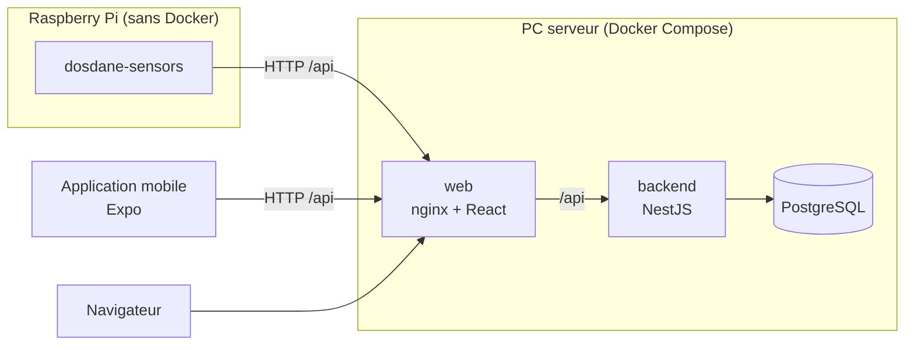

# Architecture

## Vue d'ensemble



| Partie | Dossier | Technologie | Exécution |
| --- | --- | --- | --- |
| API | `apps/backend` | NestJS (TypeScript, Node 24, npm), Swagger | conteneur Docker |
| Site web | `apps/web` | React + Vite, servi par nginx | conteneur Docker |
| Mobile | `apps/mobile` | React Native + Expo | Expo Go / build EAS |
| Capteurs | `apps/sensors` | Python 3.11+, bibliothèque standard | service systemd sur Raspberry Pi |
| Base de données | — | PostgreSQL 17 | conteneur Docker |

Chaque partie est pour l'instant un squelette qui démarre et compile : l'API expose seulement `GET /api/health` et sa documentation Swagger, le web et le mobile affichent l'avertissement santé, le paquet capteurs lit sa configuration puis s'arrête.

## Organisation du monorepo

```
.
├── apps/
│   ├── backend/        API NestJS (+ Dockerfile)
│   ├── web/            front React (+ Dockerfile, conf nginx)
│   ├── mobile/         application Expo
│   └── sensors/        paquet Python + deploy/ (systemd, install.sh)
├── docs/               documentation technique
├── compose.yaml        stack serveur (identique pour staging et production)
├── compose.dev.yaml    surcharge de développement (rechargement à chaud)
├── .env.<env>.example  modèles de configuration par environnement
├── Taskfile.yml        commandes du projet (setup, lint, build, check, dev, up…)
├── mise.toml           versions de Node, Python et task
├── .husky/             hooks Git (lint avant commit, lint + compilation avant push)
└── .github/            CI et CD
```

Chaque application est autonome (son propre `package.json` / `pyproject.toml` et son lockfile). Cela évite les conflits de dépendances entre Expo, NestJS et Vite, et chaque image Docker se construit à partir de son seul dossier. Le `package.json` racine ne sert qu'à installer Husky.

## Swagger

L'API documente ses routes avec `@nestjs/swagger` :

- interface : `/api/docs` ;
- schéma OpenAPI (JSON) : `/api/docs-json`, utilisable pour générer un client TypeScript pour le web et le mobile.

Swagger est actif en développement et en staging, et désactivé en production sauf si `SWAGGER_ENABLED=true`. Pour documenter une route, ajouter les décorateurs `@ApiTags`, `@ApiOkResponse`, etc. (voir `apps/backend/src/health/health.controller.ts`).

## Protection des données (RGPD), à garder en tête

- Traiter localement sur le Raspberry Pi et n'envoyer au serveur que des données dérivées (angles, scores), jamais d'images brutes.
- Identifier les sessions par un pseudonyme, jamais par un nom ou un e-mail.
- Réserver la consultation des données aux administrateurs.
- Le web et le mobile affichent que l'application ne remplace pas un professionnel de santé.

## Configuration

Toute la configuration passe par des variables d'environnement, vérifiées au démarrage : une valeur invalide fait échouer le démarrage plutôt que de produire un comportement inattendu. Le détail est dans [deploiement.md](deploiement.md).
