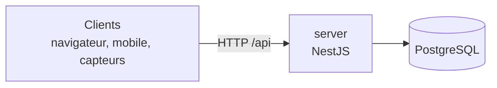

# Architecture

## Vue d'ensemble



| Partie | Dossier | Technologie | Exécution |
| --- | --- | --- | --- |
| Serveur | `server` | NestJS (TypeScript, Node 26, npm 11), Swagger | conteneur Docker |
| Base de données | — | PostgreSQL 18 | conteneur Docker |

Le serveur est pour l'instant un squelette : il expose seulement `GET /api/health` et sa documentation Swagger. PostgreSQL est prêt dans Docker Compose mais le serveur ne s'y connecte pas encore (`DATABASE_URL` est déjà fournie).

## Organisation du dépôt

```
.
├── server/             API NestJS (+ Dockerfile)
├── docs/               documentation technique
├── scripts/doctor.sh   vérification de l'environnement (task doctor)
├── compose.yaml        stack serveur + base (identique pour staging et production)
├── compose.dev.yaml    surcharge de développement (rechargement à chaud)
├── .env.<env>.example  modèles de configuration par environnement
├── Taskfile.yml        commandes du projet (setup, lint, build, check, dev, up…)
├── mise.toml           versions de Node et task + vérification à l'entrée du dossier
├── package.json        Husky uniquement (le serveur a son propre package.json)
├── .husky/             hooks Git (lint avant commit, lint + compilation avant push)
└── .github/            CI et CD
```

De nouvelles applications (web, mobile, capteurs) pourront être ajoutées à la racine, chacune dans son dossier avec ses propres dépendances.

## Swagger

Le serveur documente ses routes avec `@nestjs/swagger` :

- interface : `/api/docs` ;
- schéma OpenAPI (JSON) : `/api/docs-json`, utilisable pour générer un client TypeScript.

Swagger est actif en développement et en staging, et désactivé en production sauf si `SWAGGER_ENABLED=true`. Pour documenter une route, ajouter les décorateurs `@ApiTags`, `@ApiOkResponse`, etc. (voir `server/src/health/health.controller.ts`).

## Protection des données (RGPD), à garder en tête

- N'envoyer au serveur que des données dérivées (angles, scores), jamais d'images brutes.
- Identifier les sessions par un pseudonyme, jamais par un nom ou un e-mail.
- Réserver la consultation des données aux administrateurs.
- Rappeler dans les interfaces que l'application ne remplace pas un professionnel de santé.

## Configuration

Toute la configuration passe par des variables d'environnement, vérifiées au démarrage (`server/src/config/env.validation.ts`) : une valeur invalide fait échouer le démarrage. Le détail est dans [deploiement.md](deploiement.md).
