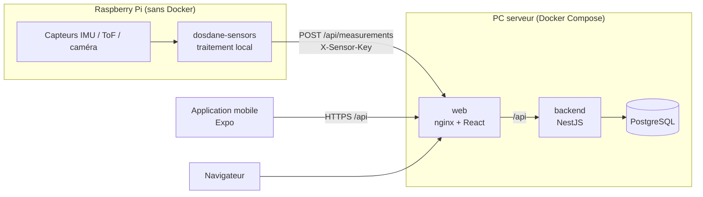

# Architecture

## Vue d'ensemble



| Partie | Dossier | Technologie | Exécution |
| --- | --- | --- | --- |
| API | `apps/backend` | NestJS (TypeScript, Node 24, npm) | conteneur Docker |
| Site web | `apps/web` | React + Vite, servi par nginx | conteneur Docker |
| Mobile | `apps/mobile` | React Native + Expo | Expo Go / build EAS |
| Capteurs | `apps/sensors` | Python 3.11+, bibliothèque standard | service systemd sur Raspberry Pi |
| Base de données | — | PostgreSQL 17 | conteneur Docker |

## Organisation du monorepo

```
.
├── apps/
│   ├── backend/     API NestJS (+ Dockerfile)
│   ├── web/         front React (+ Dockerfile, conf nginx)
│   ├── mobile/      application Expo
│   └── sensors/     paquet Python + deploy/ (systemd, install.sh)
├── docs/            documentation technique
├── compose.yaml     stack serveur (identique pour staging et production)
├── compose.dev.yaml surcharge de développement (rechargement à chaud)
├── .env.<env>.example  modèles de configuration par environnement
├── Makefile         raccourcis (make dev, make up ENV=staging, make test)
└── .github/         CI, CD, Dependabot
```

Chaque application est autonome (son propre `package.json` / `pyproject.toml` et son lockfile). Ce choix évite les conflits de dépendances entre Expo, NestJS et Vite, et permet de construire chaque image Docker à partir de son seul dossier. Les workspaces npm pourront être ajoutés plus tard si du code TypeScript doit être partagé (types de l'API par exemple).

## Contrat capteurs → API (plug and play)

Tous les capteurs envoient le même format, quel que soit le matériel :

```json
{
  "sensorId": "rpi-salle-204-imu",
  "sensorType": "imu",
  "timestamp": "2026-10-05T10:00:00Z",
  "values": { "pitch": 12.5, "roll": -3.1 },
  "sessionId": "facultatif, pseudonyme"
}
```

- Côté backend, `values` est libre : ajouter un capteur ne demande aucune modification de l'API.
- Côté Python, un capteur est une classe qui hérite de `Sensor` et se déclare par entry point (voir [capteurs.md](capteurs.md)).
- Le Raspberry Pi s'authentifie par une clé partagée (`X-Sensor-Key`), différente dans chaque environnement.

## Protection des données (RGPD)

- **Traitement local** : les images et flux bruts sont traités sur le Raspberry Pi ; seules des grandeurs dérivées (angles, distances, scores) sont envoyées.
- **Pseudonymisation** : `sessionId` ne doit jamais contenir de nom ou d'e-mail.
- **Minimisation** : le backend refuse les champs inconnus (`whitelist` + `forbidNonWhitelisted`).
- **Accès** : la consultation des mesures (`GET /api/measurements`) devra être réservée aux administrateurs (à faire).
- **Avertissement santé** : le web et le mobile affichent que l'application ne remplace pas un professionnel de santé.

## Configuration

Toute la configuration passe par des variables d'environnement, validées au démarrage de chaque partie : une valeur manquante fait échouer le démarrage plutôt que de produire un comportement inattendu. Le détail est dans [deploiement.md](deploiement.md).

## Choix à justifier dans l'étude préalable

Ces choix sont des valeurs par défaut posées avec la structure ; ils restent à confirmer et à appuyer par des sources :

- PostgreSQL plutôt qu'une base orientée séries temporelles (TimescaleDB, InfluxDB) : extension possible de PostgreSQL vers TimescaleDB sans changer de moteur.
- HTTP plutôt que MQTT pour les capteurs : plus simple pour un POC ; MQTT serait préférable pour des flux continus à haute fréquence (IMU, ToF).
- Stockage des mesures en mémoire dans le backend tant que la base n'est pas branchée.
