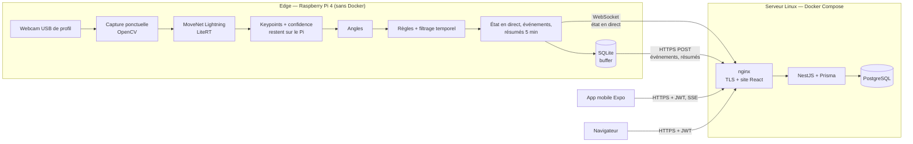
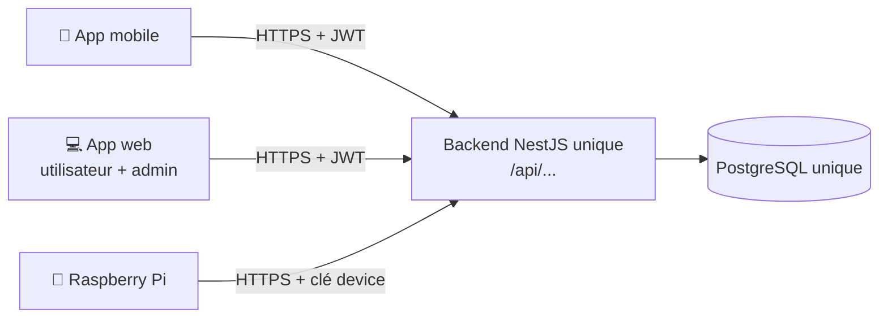
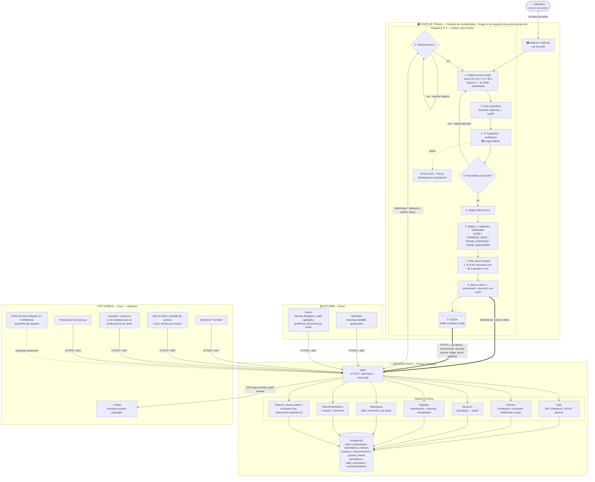
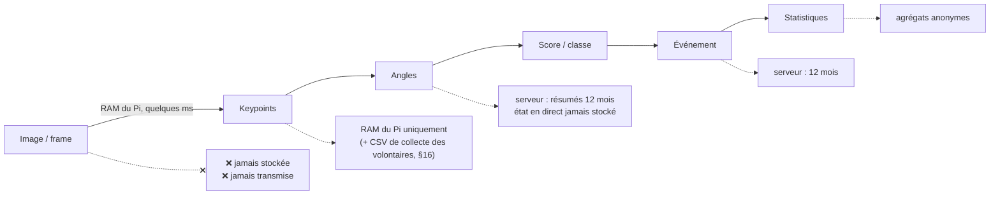
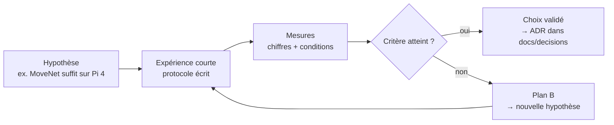

# Audit technique — Fil Rouge Master UHA 4.0 — « Dos d'âne »

> **Version courte :** pour le MVP et les présentations, la référence est [solution-mvp.md](solution-mvp.md). Elle retient **4 postures** (tête en avant, dos penché en avant, avachi en arrière, immobilité prolongée), une cadence de capture adaptative et 7 tests (T1–T7). Le présent audit reste l'annexe détaillée.

**Où trouver quoi (une seule source par sujet, pas de doublon) :**

| Sujet | Document de référence |
|---|---|
| Vue d'ensemble de la solution, tests T1–T7 | [solution-mvp.md](solution-mvp.md) |
| Algorithme : contrôles, angles, règles et **sources des seuils**, calibration, filtre dans le temps, cadence, score | [algo-posture.md](algo-posture.md) |
| Raspberry Pi : installation, code, protocole des tests, **résultats mesurés** | [poc-raspberry.md](poc-raspberry.md) |
| Architecture complète : RGPD, rôle du Pi et du serveur, **messages Pi → serveur**, données, API, sécurité, feuille de route | **ce document** |

> **Mise à jour du 9 octobre 2026 (v3.1)**, après les premiers essais sur le Raspberry Pi :
> - **les keypoints ne quittent plus le Pi** : le serveur ne reçoit que l'état en direct, les événements et des résumés toutes les 5 min (§7.2, §12). Le dataset vient des enregistrements étiquetés faits sur le Pi avec des volontaires (§16) ;
> - **webcam USB** (Logitech C110) à la place de l'Arducam CSI, Raspberry Pi OS 13 « Trixie », Python 3.13 ; mesures réelles : capture ~55 ms, MoveNet ~21 ms (§5) ;
> - **4 postures** : `FORWARD_HEAD`, `TRUNK_FORWARD`, `TRUNK_BACKWARD`, `IMMOBILE`. `NECK_FLEXION` passe après le MVP ; `TRUNK_FLEXION` devient `TRUNK_FORWARD` (§8) ;
> - **cadence adaptative** 10 s / 2 s / 30 s au lieu d'une cadence fixe (§6) ; seuil de confiance **0,20** au lieu de 0,30 (mesuré) ;
> - le détail de l'algorithme est déplacé dans [algo-posture.md](algo-posture.md) ; le contenu de l'ancien `poc-edge.md` est intégré ici (§7.2, §15).

> **Version v3** : révision de la v2 après confrontation avec le sujet officiel *Fil rouge Master 2026* et avec le dépôt `dos-d-ane`.
>
> Principaux changements par rapport à la v2 :
> - ajout d'une **matrice de conformité** au sujet (§2) ;
> - **application mobile** remontée dans le MVP, car le sujet lui attribue les fonctions « personne aidée » ;
> - ajout de l'**annotation des données** et de la constitution d'un **dataset**, exigées par le sujet et absentes de la v2 ;
> - **cadence de capture sobre**, alors que la v2 raisonnait en flux vidéo (exigence « développement responsable ») ;
> - **caméra fixe latérale** et postures MVP révisées, car la v2 demandait trois postures impossibles à mesurer avec une seule caméra ;
> - **modèle de données générique** pour le « plug n play » (plusieurs types de capteurs) ;
> - nouvelles sections : appairage utilisateur ↔ poste, sécurité, RGPD détaillé, avertissement santé, risques, objectifs chiffrés, répartition IA, sources académiques ;
> - déploiement aligné sur le dépôt (web conteneurisé, CI/CD) ;
> - schémas de bout en bout (§4), capacité du Raspberry Pi 4 (§5), phase PC puis Raspberry et répartition Pi / serveur (§7), gestion des erreurs de l'IA (§10), squelette animé sur le mobile et le web (§17), plan de validation E1–E17 (§21).
>
> **Statut :** les choix décrits ici sont des **hypothèses argumentées**. Chacun doit être confirmé ou remplacé par les expériences du **§21** (plan E1–E17) avant d'être considéré comme définitif.

---

## 1. Contexte et objectif

Le sujet demande un **POC** de système d'amélioration de la posture pour des personnes en travail sédentaire (développement informatique) dans les locaux d'UHA 4.0. Il mobilise trois domaines : objets connectés, programmation mobile et reconnaissance d'images.

Le **MVP exigé par le sujet** est une interface qui présente à l'utilisateur **des conseils de posture et des exercices**, en indiquant clairement que l'application **ne remplace pas un professionnel de santé**. Un **administrateur** peut visualiser les flux de données et les problèmes les plus fréquents.

Notre groupe se concentre sur :

1. **l'analyse de posture par caméra fixe**, avec un traitement IA embarqué (edge) ;
2. **l'application mobile de la personne aidée** : sessions, conclusions, conseils, progression, et analyse par photo en itération 2 ;
3. **la visualisation et l'annotation côté administrateur** ;
4. **la protection des données** dès la conception (privacy by design).

Les capteurs **TOF et IMU** ne font pas partie de notre périmètre MVP, mais l'architecture est conçue pour les accueillir sans refonte (§11, plug n play).

### Problématique

> **Comment concevoir un système intelligent capable de détecter automatiquement et de manière non intrusive les mauvaises postures d'une personne travaillant devant un ordinateur, tout en minimisant la collecte, le stockage et le transfert de données personnelles ?**

Phrase à retenir pour présenter le projet :

> *La caméra voit la personne, le Raspberry transforme localement l'image en données numériques, l'image disparaît, et seul le résultat est envoyé au serveur.*

### Choix non retenus (et pourquoi)

Le sujet demande de choisir une approche, de l'étudier et de **justifier** ce choix.

| Option | Avantages | Pourquoi elle n'est pas retenue pour le MVP |
|---|---|---|
| **IMU** (portés sur le corps) | données légères, aucune image, mesure continue | il faut **porter ou fixer** des capteurs sur soi : intrusif, contraignant au quotidien, plus d'abandons. La caméra est **transparente** : on s'assoit, on travaille, le système analyse. |
| **Arduino / ESP32** | faible consommation, adapté aux IMU | inutile sans IMU. Le Raspberry suffit pour la caméra et l'inférence. |
| **TOF** | profondeur, moins identifiant qu'une image | matériel à valider, et pas de modèle de pose prêt à l'emploi comparable à MoveNet |
| **Traitement de l'image sur le serveur** | plus de puissance de calcul | transfert d'images contraire aux règles RGPD du sujet (§3) |
| **FastAPI** (au lieu de NestJS) | même langage que l'edge (Python) | NestJS est déjà en place dans le dépôt, avec un typage partagé avec le web et le mobile en TypeScript |
| **MQTT** (au lieu de WebSocket + HTTPS) | conçu pour l'IoT, adapté aux flux continus | à notre cadence (un état toutes les 2 à 10 s, un résumé toutes les 5 min, quelques événements), une WebSocket et des requêtes HTTPS suffisent, sans broker supplémentaire à opérer. MQTT reste pertinent si on ajoute des IMU en flux continu (§25). |
| **Arducam CSI** (au lieu d'une webcam USB) | caméra officielle du Pi, compacte | nappe courte (placement de profil difficile) et code différent (`picamera2`). La webcam USB fonctionne avec le même code OpenCV sur PC et sur Pi. L'Arducam reste un plan B. |

---

## 2. Matrice de conformité au sujet

Légende : ✅ MVP · 🔁 itération 2 · 🔭 évolution prévue (architecture prête) · ⛔ hors périmètre (justifié)

| Exigence du sujet | Réponse | Statut | § |
|---|---|---|---|
| Analyse de posture par caméra fixe | Raspberry Pi 4 + webcam USB de profil + MoveNet | ✅ | 5–8 |
| Limiter le nombre de captures | cadence adaptative : 1 capture toutes les 10 s, 2 s en cas de doute, 30 s si personne ; aucun flux vidéo | ✅ | 6 |
| Analyse par photo de téléphone | Photo frontale analysée **sur le téléphone** | 🔁 | 17 |
| Capteurs embarqués du téléphone (poche) | Modèle de mesure générique prêt | 🔭 | 11 |
| Capteur TOF | Modèle de mesure générique prêt | ⛔ / 🔭 | 11 |
| Capteurs IMU | Modèle de mesure générique prêt | ⛔ / 🔭 | 11 |
| Les données ne doivent pas permettre d'identifier | Aucune image stockée ni transmise ; pseudonymes ; vues admin agrégées | ✅ | 14–15 |
| Automatiser le traitement des vidéos | Pipeline entièrement automatique sur l'edge | ✅ | 7 |
| Accès aux données originales restreint | Rôles USER / ADMIN / DEVICE ; table d'identité séparée | ✅ | 14 |
| Favoriser le traitement sans transfert | Edge AI : l'image ne quitte jamais l'appareil | ✅ | 4 |
| Ne pas stocker la donnée brute inutile | Frames en RAM uniquement | ✅ | 12 |
| Admin : historique par capteur | Dashboard admin par device | ✅ | 18 |
| Admin : suivre plusieurs utilisateurs | Sessions utilisateur ↔ poste | ✅ | 13 |
| Admin : **annoter les données** | MVP : étiquetage à l'enregistrement sur le Pi (volontaires) et retour « fausse alerte » de l'utilisateur ; ensuite : outil web d'annotation des événements | ✅ / 🔁 | 16 |
| Admin : problèmes récurrents (matériel inadapté ?) | Agrégation par **poste de travail** | ✅ | 18 |
| Admin : alertes anonymisées | Liste d'alertes sous pseudonyme | ✅ | 18 |
| Mobile : démarrer une session de capture | Bouton « Démarrer » (un seul Pi dans le MVP) ; QR code par poste quand il y aura plusieurs postes | ✅ | 13 |
| Mobile : conclusions | Résumé de session | ✅ | 17 |
| Mobile : ressources (articles, exercices) | Recommandations liées au type de posture | ✅ | 17 |
| Mobile : progression au fil des jours | `daily_summaries` | ✅ | 17 |
| Web : données de l'utilisateur | Dashboard personnel React | ✅ | 17 |
| Analyse de postures dynamiques (exercices) | — | 🔭 | 25 |
| Avertissement « ne remplace pas un professionnel de santé » | Affiché sur le web et le mobile (déjà dans le dépôt) | ✅ | 15 |
| Approche plug n play | Enrôlement des devices et mesures génériques | ✅ | 11, 14 |
| Justifier les choix par des sources académiques | Section sources + plan d'expériences | ✅ | 21, 28 |
| Travail réutilisable par de futurs modèles d'IA | Dataset étiqueté (keypoints + angles + label, sans image) issu des enregistrements de volontaires, avec sa fiche descriptive | ✅ | 16 |
| Chaque étudiant de 4.0.5 traite un sujet d'IA | Répartition proposée | ✅ | 23 |
| Documentation : choix, blocages, répartition | Expériences, ADR, journal des blocages dans `docs/` | ✅ | 21, 24 |

---

## 3. Écart assumé avec le schéma d'architecture du sujet

Dans le schéma proposé par le sujet, le Raspberry envoie des **photos et vidéos** au serveur, qui héberge l'« IA de détection lourde » puis anonymise et historise.

Nous faisons un choix différent : **l'image ne quitte jamais l'edge**. Ce choix s'appuie sur les exigences RGPD du sujet lui-même :

- « Tout traitement qui peut être réalisé sans transfert de donnée est à favoriser » ;
- « Si la donnée brute n'apporte pas de plus-value, elle ne doit pas être stockée ».

L'architecture reste **hybride**, comme dans le schéma du sujet, mais sur des données dérivées :

| Niveau | Schéma du sujet | Notre implémentation |
|---|---|---|
| Edge | « IA légère, détection de première intention » | Pose estimation (MoveNet), angles, règles, filtrage temporel |
| Serveur | « IA de détection lourde » | Historique, statistiques, **détection des problèmes récurrents** par poste. L'**entraînement** d'un classifieur (itération 2) se fait hors ligne sur le dataset étiqueté (§16) ; le modèle entraîné est ensuite exécuté sur l'edge (§7). |

On transmet ainsi des **résultats** (angles, postures, scores, événements), jamais les pixels ni les points du corps.

---

## 4. Architecture générale



Principe central :

> **La machine qui possède la caméra analyse l'image localement. Seuls des résultats (angles, postures, scores, événements, résumés) sont transmis ; ni l'image ni les points du corps.**

### Répartition des responsabilités

| Composant | Fait | Ne fait pas |
|---|---|---|
| **Edge** (Pi 4) | capture ponctuelle, pose estimation, angles, règles, filtrage temporel, score, résumés 5 min, buffer SQLite, envoi, affichage local de debug | stockage long terme, stockage d'images, envoi des keypoints, statistiques globales |
| **Backend** (NestJS) | authentification, devices, sessions, ingestion, historique, statistiques, recommandations, relais de l'état en direct, seuils envoyés au Pi, retours « fausse alerte » | réception d'images ou de keypoints, classification en temps réel |
| **Web** (React) | dashboard personnel, dashboard admin ; ensuite : annotation des événements | — |
| **Mobile** (Expo) | démarrage de session, état en direct, alertes, conclusions, conseils et exercices, progression, analyse photo locale (itération 2) | envoi de photos |

### Un seul backend pour tout le monde

**L'app mobile, l'app web et les Raspberry utilisent le même backend NestJS**, donc la même API, la même base PostgreSQL et les mêmes comptes.



Conséquences :

- **un seul compte** : l'utilisateur se connecte avec les mêmes identifiants sur le mobile et le web, et voit les **mêmes données** des deux côtés ;
- **une seule logique métier** : score, statistiques et conseils sont calculés une seule fois, côté serveur, et les deux apps les affichent simplement ;
- **un seul contrat d'API** documenté par Swagger, d'où l'on génère le client TypeScript partagé par le web et le mobile ;
- les droits dépendent du **rôle** dans le JWT (`USER`, `ADMIN`) ou de la **clé de device** (`DEVICE`), pas de l'application utilisée.

### 4.1 Schéma complet de la solution

Traits pleins : MVP. Traits pointillés : itération 2 et options. Les numéros suivent le parcours d'une donnée. Le détail des étapes 4 à 8 est dans [algo-posture.md](algo-posture.md).



### 4.2 Fonctionnement de bout en bout (mobile + Raspberry + web)

Les phases dans l'ordre :

| Phase | Où | Ce qui se passe |
|---|---|---|
| A. Connexion | mobile et web | même compte, même backend |
| B. Démarrage | mobile → backend → Pi | « Démarrer » : le backend crée la session et prévient le Pi par sa WebSocket |
| C. Surveillance | Pi | capture, IA, angles, filtrage ; envoi de résultats uniquement (état en direct, résumés) |
| D. Alerte | backend → mobile | alerte si une mauvaise posture dure (SSE si l'app est ouverte, push ensuite) |
| E. Fin de session | mobile | résumé, conseils, exercices |
| F. Consultation | web | historique détaillé de l'utilisateur |
| G. Administration | web admin | statistiques agrégées, problèmes par poste, annotation |

```mermaid
sequenceDiagram
    autonumber
    actor U as Utilisateur
    participant M as 📱 App mobile
    participant W as 💻 App web
    participant B as Backend NestJS
    participant D as PostgreSQL
    participant P as 🍓 Pi + webcam
    actor A as Admin

    rect rgba(120,120,120,0.08)
    Note over U,B: A. Connexion — même compte sur le mobile et le web
    U->>M: email + mot de passe
    M->>B: POST /api/auth/login
    B->>D: vérifie le compte
    B-->>M: JWT rôle USER
    end

    rect rgba(120,120,120,0.08)
    Note over U,P: B. Démarrage de session
    U->>M: « Démarrer » (un seul Pi dans le MVP ; QR du poste ensuite)
    M->>B: POST /api/sessions
    B->>D: session active participant ↔ poste
    B-->>P: WebSocket : « démarre, session ses_8f2c41 » + seuils
    Note over P: calibration : 10 s de posture de référence
    end

    rect rgba(120,120,120,0.08)
    Note over P: C. Surveillance — tout se passe sur le Pi
    loop toutes les 10 s (2 s en cas de doute)
        P->>P: capture → MoveNet → keypoints → image effacée
        P->>P: confidence ? → angles → règles → fenêtre glissante
        P-->>B: WebSocket : état en direct (posture, angles, score)
        B-->>M: SSE : relayé, non stocké
    end
    P->>B: POST /api/ingest/measurements (résumé toutes les 5 min)
    B->>D: résumés (chiffres uniquement)
    opt réseau coupé
        P->>P: SQLite puis renvoi (UUID → pas de doublon)
    end
    end

    rect rgba(120,120,120,0.08)
    Note over P,M: D. Alerte
    P->>B: POST /api/ingest/events FORWARD_HEAD (confirmé)
    B->>D: événement
    B-->>M: alerte « tête en avant » (SSE, puis push)
    end

    rect rgba(120,120,120,0.08)
    Note over U,B: E. Fin de session
    U->>M: Terminer
    M->>B: PATCH /api/sessions/:id/end
    B->>D: calcule le résumé + daily_summary
    B-->>M: score, durées, exercices, avertissement santé
    B-->>P: WebSocket : « arrête » → plus aucune capture
    end

    rect rgba(120,120,120,0.08)
    Note over U,B: F. Consultation sur le web — mêmes données
    U->>W: se connecte avec le même compte
    W->>B: GET /api/me/history
    B->>D: lecture
    B-->>W: courbes, répartition, progression
    end

    rect rgba(120,120,120,0.08)
    Note over A,B: G. Administration
    A->>W: se connecte (rôle ADMIN)
    W->>B: GET /api/admin/statistics, /workstations/:id/issues
    B-->>W: agrégats anonymes par poste et par posture
    end
```

### 4.3 Où se trouve chaque donnée



Plus on avance dans la chaîne, moins la donnée est sensible.

---

## 5. Matériel edge

Configuration réelle (installée le 7 octobre 2026, détail et blocages dans [poc-raspberry.md](poc-raspberry.md) §3.5) :

| Élément | Choix | Remarques |
|---|---|---|
| Carte | **Raspberry Pi 4, 2 Go** | Raspberry Pi OS **64 bits**, Debian 13 « Trixie » |
| Caméra | **webcam USB Logitech C110** (pilote `uvcvideo`), 640×480 | même code OpenCV sur PC et sur Pi ; câble long, facile à placer de profil. ⚠️ Éviter les vieilles webcams à pilote `gspca_*` : la LifeCam VX-1000 figeait le Pi. Arducam CSI (`picamera2`) : plan B seulement. |
| Horloge | **NTP obligatoire** | Le Pi 4 n'a pas d'horloge à pile : sans NTP, les timestamps des données mises en buffer hors ligne sont faux. |
| Python | **3.13 sur le Pi** ; code compatible 3.11+ | environnement `edge/.venv`, versions figées dans `requirements.txt` |
| Runtime IA | **LiteRT** (`ai-edge-litert` 2.3.0, successeur de `tflite-runtime`) | installé sans erreur en aarch64 |

### Le Raspberry Pi 4 peut-il tout faire tourner ?

**Oui, car il ne fait tourner que la partie edge.** Le backend, la base, le web et le mobile sont sur le serveur ou sur le téléphone, pas sur le Pi.

Mesuré sur le Pi (octobre 2026) :

| Pour 1 image | Temps |
|---|---|
| capture d'une image fraîche | ~55 ms |
| MoveNet Lightning int8 (4 threads) | ~21 ms (float16 : ~36 ms) |
| angles, règles, filtre | < 1 ms |
| **total** | **~80 ms** |

Soit environ **4 % d'un cœur** à la cadence la plus rapide (1 image / 2 s), et moins de 1 % à 1 image / 10 s, pour ~100 Mo de mémoire. Le test T1 complet (100 mesures, image réelle, 1/2/4 threads) reste à faire.

Ce qui ne tourne **pas** sur le Pi : NestJS, PostgreSQL, React, Expo, l'entraînement d'un modèle.

Conditions pour que ça marche :

- **dissipateur thermique** : sans dissipateur, l'IA en continu (outil de debug `live.py`) monte le Pi à ~76 °C en 5 min ; au-delà de 80 °C il ralentit. À la cadence d'une vraie session, la charge est très faible ;
- alimentation officielle 5 V / 3 A (une alimentation sous-dimensionnée provoque une baisse de fréquence) ;
- **valider par les tests** : caméra (T2 ✅ 0 échec sur 526 captures), vitesse (T1), tenue sur 8 h (endurance), voir §21.

Plan B si les performances sont insuffisantes : réduire la cadence, réduire la résolution de capture, ou, en dernier recours, passer sur un mini-PC à la place du Pi. L'architecture ne change pas, seul le matériel edge change.

---

## 6. Cadence de capture — développement responsable

Le sujet précise : *« L'analyse ne nécessite pas un flux vidéo intense ; les postures changent rarement… il est important de limiter le nombre de captures. »*

La v2 raisonnait en flux continu (FPS). La v3 adopte une **capture ponctuelle et adaptative** : une image toutes les **10 s** quand tout va bien, toutes les **2 s** dès qu'une image est mauvaise (pour confirmer vite), toutes les **30 s** si personne n'est au poste. Chaque image est analysée puis effacée de la RAM. Règle exacte : [algo-posture.md](algo-posture.md), « Les règles en une page ».

- **Envoi au serveur** : un état en direct par image (relayé, non stocké), un résumé toutes les 5 min et les événements confirmés, **jamais une image** (§7.2).
- **Mesures à rapporter** (argument « développement responsable ») : nombre de captures, CPU, température et volume réseau, cadence adaptative comparée à une cadence fixe de 2 s (test T7).

---

## 7. Pipeline IA sur l'edge

Les étapes du pipeline sont dans le schéma du §4.1. Le fonctionnement détaillé de l'algorithme (contrôles, angles, règles, filtre, score) est dans [algo-posture.md](algo-posture.md).

### Modèle

| Rôle | Modèle | Justification |
|---|---|---|
| **Principal** | MoveNet SinglePose **Lightning** int8 (LiteRT) | léger (quelques Mo), conçu pour l'embarqué, 17 keypoints suffisants pour une vue de profil, ~21 ms sur le Pi 4 |
| **Benchmark** | MediaPipe Pose (BlazePose) | 33 landmarks, coordonnée de profondeur estimée ; comparaison sur la précision, la stabilité, le temps d'inférence, le CPU, la RAM et la facilité de déploiement sur Pi (test T4) |
| Écartés | MoveNet Thunder, OpenPose, YOLO-Pose | trop lourds pour le Pi |
| Multi-personne (évolution) | MoveNet **MultiPose** Lightning | modèle différent de SinglePose ; il faut un tracking anonyme en plus |

MoveNet ne « sait » pas si une posture est bonne : **il produit un squelette**. Le diagnostic vient de notre logique (règles, puis éventuellement un classifieur appris).

### Le même code sur PC et sur Raspberry

Grâce à la webcam USB, **le même code Python** tourne sur un PC et sur le Pi : seul le matériel change. En pratique, le POC a été développé **directement sur le Pi** (dépôt `~/dos-d-ane`, branche `feat/edge-poc`), avec l'outil de debug `live.py` affiché sur l'écran du Pi : les risques matériels (caméra, runtime IA, vitesse, chauffe) ont ainsi été levés dès le début. Si un problème apparaît sur un autre poste, on sait qu'il vient de l'environnement et non de l'algorithme.

### 7.1 Que fait le Pi, que fait le serveur ?

**Règle :** le **temps réel** se fait sur le Pi, l'**analyse globale et différée** se fait sur le serveur. Le serveur **ne refait pas** le même calcul que le Pi.

| Analyse | Où | Pourquoi là |
|---|---|---|
| Pose estimation (image → keypoints) | **Pi, obligatoirement** | c'est la seule étape qui touche l'image : elle doit rester locale (RGPD) |
| Angles, règles, filtre → posture, score, événements | **Pi** | fonctionne même **sans réseau** (buffer SQLite) ; réaction immédiate ; seul le Pi a les keypoints et la posture de référence |
| Statistiques quotidiennes, progression, conseils | **serveur** | il faut l'historique de toutes les sessions |
| **Problèmes récurrents par poste** (matériel inadapté) | **serveur** | il faut comparer **plusieurs utilisateurs** sur le même poste |
| **Entraînement** d'un classifieur (itération 2) | **poste de dev**, hors ligne (scikit-learn) | sur le dataset étiqueté des volontaires (§16) ; le modèle (quelques Ko) est ensuite déployé sur le Pi |
| **Fusion multi-caméras** (profil + face, évolution) | **serveur** | lui seul reçoit les résultats des deux Pi |
| Analyse de la photo mobile (itération 2) | **téléphone** | même principe que le Pi : l'image reste sur l'appareil |

**Proposition retenue : algorithme sur le Pi, seuils pilotés par le serveur.** Les seuils (angles, 70 %, 40 %, 2 min…) sont **envoyés par le serveur** au démarrage de la session et réglables depuis le site admin, sans redéployer le Pi. Le Pi garde les derniers seuils reçus si le serveur est injoignable.

**Alternative écartée :** le Pi envoie les keypoints et le serveur fait toute la classification. Avantage : règles modifiables et historique réanalysable côté serveur. Inconvénients : les points du corps de chaque personne sortent du poste et sont stockés, plus aucune détection si le réseau tombe, un flux continu au lieu de quelques messages, et une logique Python à réécrire côté serveur. Les seuils pilotés par le serveur donnent la même souplesse sans ces inconvénients.

### 7.2 Ce qui sort du Pi : messages et transport

**Ce qui ne sort jamais :** image, frame, pixels, vidéo, **ni les keypoints** (points du corps).
**Ce qui sort :** angles, posture, couleur, score, événements, résumés, horodatage, tous marqués du numéro de session. Le Pi ne connaît ni le nom, ni l'email de la personne.

| Message | Sens | Quand | Transport | Stocké ? |
|---|---|---|---|---|
| **Commandes** : démarrer / arrêter la session `ses_…`, seuils | serveur → Pi | au démarrage, à l'arrêt, quand l'admin change un seuil | **WebSocket** | — |
| **État en direct** : posture, couleur, angle tête, angle tronc, score de l'image | Pi → serveur → app | à chaque image (2 à 10 s) | Pi → serveur : **WebSocket** ; serveur → app : **SSE** | ❌ relayé seulement |
| **Événement** : début et fin d'une alerte | Pi → serveur → app | quand le filtre dans le temps confirme | Pi → serveur : **HTTPS POST** ; serveur → app : **SSE** (+ notification push) | ✅ |
| **Résumé** : score moyen, temps 🟢 / 🟠 / 🔴, temps ignoré | Pi → serveur | toutes les 5 min | **HTTPS POST** | ✅ |
| **Actions de l'utilisateur** : connexion, démarrer, terminer, historique | app → serveur | à la demande | **HTTPS (REST)** | ✅ |

```json
// état en direct (WebSocket)
{ "session": "ses_8f2c41", "t": "2026-10-08T14:05:12Z", "posture": "FORWARD_HEAD",
  "couleur": "rouge", "tete": 68.2, "tronc": 5.0, "score": 64 }

// événement (HTTPS POST)
{ "id": "evt_0193", "session": "ses_8f2c41", "type": "FORWARD_HEAD", "phase": "debut",
  "debut": "2026-10-08T14:03:10Z", "tete_moy": 68.4, "tronc_moy": 6.1 }

// résumé (HTTPS POST)
{ "id": "res_0042", "session": "ses_8f2c41", "periode": "14:00-14:05", "score_moyen": 78,
  "secondes_bonne": 210, "secondes_moyenne": 60, "secondes_a_ameliorer": 30, "secondes_ignore": 0 }
```

Les **bonnes postures sont donc aussi envoyées**, sous forme de temps et de score dans les résumés (calcul du score : [algo-posture.md](algo-posture.md) §7.4).

**Pourquoi ces choix :**

- **WebSocket entre le Pi et le serveur** : c'est le Pi qui ouvre la connexion (sortante), donc elle passe les box et pare-feu, et le serveur peut lui envoyer des commandes sans connaître son adresse. Une seule connexion sert aux deux sens. Si elle tombe, le Pi la rouvre et continue d'analyser avec les derniers seuils reçus.
- **HTTPS POST pour ce qui est stocké** (événements, résumés) : chaque message a un `id`, le serveur ignore un doublon. Si le réseau est coupé, le Pi garde les messages dans son buffer SQLite (§20) et les renvoie plus tard.
- **SSE entre le serveur et l'app** : l'app n'a besoin que de **recevoir** (état en direct, alertes) ; ses actions passent par le REST classique. NestJS le gère nativement (`@Sse`). Une WebSocket convient aussi si l'équipe préfère une seule technologie.
- **Limite importante :** WebSocket et SSE ne fonctionnent que **quand l'app est ouverte**. Pour que l'alerte arrive téléphone verrouillé, il faut une **notification push** (Firebase Cloud Messaging ou Expo Push), envoyée par le serveur à la réception d'un événement « début ». **MVP :** alerte par SSE quand l'app est ouverte ; **push** dès que possible.

---

## 8. Placement de la caméra et postures MVP

### Problème de la v2

Avec **une seule caméra**, la v2 voulait détecter `FORWARD_HEAD` et `ROUNDED_BACK`, qui demandent une **vue de profil**, et `SHOULDER_ASYMMETRY`, qui demande une **vue de face**. C'est incohérent. De plus :

- MoveNet n'a **aucun point le long de la colonne** : la courbure du dos (cyphose) n'est pas mesurable. On mesure seulement l'**inclinaison du tronc** (ligne épaule-hanche) ;
- en vue de face, le bureau et l'écran **masquent souvent les hanches**.

### Décision v3

**Caméra fixe latérale** à environ 1,5–3 m, à hauteur d'épaule, perpendiculaire au plan sagittal de la personne. En vue de profil, les hanches restent visibles au-dessus de l'assise.

| Posture MVP | Métrique | Keypoints | Vue |
|---|---|---|---|
| `FORWARD_HEAD` (tête en avant) | angle **tête** : droite épaule → oreille par rapport à l'horizontale (angle cranio-vertébral approché) | oreille, épaule (côté visible) | profil |
| `TRUNK_FORWARD` (dos penché en avant, remplace `ROUNDED_BACK`) | angle **tronc** : droite hanche → épaule par rapport à la verticale | épaule, hanche | profil |
| `TRUNK_BACKWARD` (avachi en arrière) | même angle **tronc**, vers l'arrière | épaule, hanche | profil |
| `IMMOBILE` (immobilité prolongée) | déplacement médian des points ÷ longueur du tronc | tous les points fiables | profil |
| *après le MVP* : `NECK_FLEXION` (cou penché vers le bas) | angle oreille–épaule–hanche, déjà relevé par `live.py` pour être testé | oreille, épaule, hanche | profil |
| *itération 2* : `SHOULDER_ASYMMETRY` | inclinaison de la ligne des épaules | 2 épaules | **face → photo mobile** ou 2e caméra |

Ce choix de 4 postures est justifié dans [solution-mvp.md](solution-mvp.md) §4 (« Pourquoi pas plus ? »). L'**analyse par photo mobile** demandée par le sujet complète la caméra fixe : la caméra couvre le profil en continu, la photo frontale couvre l'asymétrie ponctuellement.

### Côté visible

En vue de profil, un seul côté est fiable. On retient le côté dont la confiance moyenne (oreille, épaule, hanche) est la plus élevée, puis on le **bloque** pour la session : de profil, MoveNet devine le côté caché avec une confiance parfois aussi haute, et le côté changeait d'une image à l'autre.

---

## 9. Seuils, calibration et score

Les seuils ne sont **pas arbitraires** : ils partent de méthodes d'ergonomie publiées (angle cranio-vertébral, **RULA**, **REBA**, **ISO 11226**), puis sont **personnalisés** par une calibration de 10 s (la personne se tient droite, on compare ensuite à **sa** posture) et **ajustés par nos mesures** (test T5 : F1 ≥ 0,80 par posture).

Le tableau complet — pour chaque posture : angle mesuré, seuil de départ, **source**, seuil calibré, **durée avant alerte** — ainsi que la formule du score (0–100) sont dans [algo-posture.md](algo-posture.md), « Les règles en une page » et §7.4. **Le score n'est pas un indicateur médical.**

### Apprendre au système ce qu'est une bonne posture

**On ne réentraîne pas MoveNet.** Il continue à faire image → keypoints. Les exemples servent à **notre couche de décision**, celle qui passe des keypoints à « bonne » ou « mauvaise ».

1. **Enregistrer des exemples étiquetés** sur le Pi avec `live.py` : la personne prend chaque posture pendant 30 s, une touche indique laquelle (`0` bonne, `1` tête en avant, `2` dos penché, `3` avachi, `4` dos en « C »). Le CSV contient les angles, les confiances et les 17 points, **jamais l'image**.
2. **Normaliser** : on travaille surtout sur des **angles** et des distances divisées par la longueur du tronc, qui ne changent pas quand la personne se décale ou s'éloigne.
3. **Trois approches à comparer** dans le rapport :

| Approche | Principe | Quand |
|---|---|---|
| **Règles + seuils** | seuils tirés de la littérature, ajustés grâce aux exemples | MVP |
| **Référence personnelle** | calibration : écart à la bonne posture de *cette* personne | MVP |
| **Classifieur appris** | arbre de décision, Random Forest ou SVM (scikit-learn) entraîné sur les exemples étiquetés de tous les volontaires | itération 2, une fois assez d'exemples collectés |

**Évaluation :** validation croisée **par personne** (on teste sur des personnes absentes de l'entraînement), puis matrice de confusion et F1 (§21).

**Attention à la vue caméra :** des exemples enregistrés **de face** ne valent rien pour la caméra **de profil**. Tous les exemples sont enregistrés de profil.

---

## 10. Quand l'IA se trompe : erreurs et corrections

MoveNet est un modèle pré-entraîné : il **peut se tromper**, et un point mal placé fausse les angles. Le système ne doit donc **jamais** fonctionner ainsi :

```text
1 capture mauvaise → ALERTE        ❌
```

Les protections déjà en place, chacune face à l'erreur qu'elle corrige, sont détaillées dans [algo-posture.md](algo-posture.md) §6 :

| Erreur | Protection |
|---|---|
| point mal détecté (contre-jour, oreille cachée) | confiance < 0,20 → image ignorée (`UNKNOWN`) ; un **seul** point manquant depuis ≤ 2 s est repris de l'image précédente |
| personne de face ou en biais | écart des épaules ÷ tronc > 0,35 → image ignorée |
| côté gauche / droit qui saute | côté bloqué pour la session |
| morphologie, placement de la caméra | calibration individuelle + consigne de placement |
| geste bref (boire, ramasser un stylo), points qui tremblent | filtre dans le temps : 70 % de mauvaises images sur 60 s pendant 2 min |
| alerte qui clignote | hystérésis : fin d'alerte sous 40 % |
| alertes à répétition | pas de nouvelle alerte du même type avant 10 min |
| poste vide | `NO_PERSON` : prochaine capture dans 30 s |

**Pas encore codé, à ajouter si les tests le demandent :** contrôle de cohérence (point faux mais confiance haute, par exemple une épaule placée sur le dossier) et médiane d'une rafale de 3 images (si le filtre dans le temps ne suffit pas contre le tremblement).

### Boucle d'amélioration continue

1. **Mesurer les erreurs** : les sessions jouées par des volontaires, avec étiquettes connues (§16), donnent une matrice de confusion, donc la précision, le rappel et le F1 (§21).
2. **Retour utilisateur** : bouton « ce n'était pas une mauvaise posture » sur l'alerte. Il crée une annotation `FALSE_POSITIVE` sur l'événement.
3. **Ajuster** les seuils, la fenêtre et la durée minimale, puis créer une nouvelle `algo_version` envoyée au Pi par le serveur.
4. **Comparer** l'ancienne et la nouvelle version en rejouant les enregistrements étiquetés (`evaluer.py`), puis sur le taux de fausses alertes signalées.
5. **Itération 2** : remplacer les règles par un classifieur entraîné sur le dataset, et le comparer aux règles sur les mêmes données.

À rappeler : la **confiance d'un keypoint n'est pas une confiance médicale** dans le diagnostic, et le système ne pose **aucun diagnostic de santé**.

---

## 11. Modèle de données générique (plug n play)

Le sujet exige une collecte « plug n play » qui permette d'ajouter **d'autres caméras, d'autres personnes et d'autres moyens de capture** (téléphone, TOF, IMU). La v2 avait une table `measurements` avec des colonnes spécifiques à la caméra (`neck_angle`…), ce qui bloque l'ajout d'un IMU.

### Schéma proposé (Prisma / PostgreSQL)

```text
users            id, email, password_hash, role (USER|ADMIN), created_at
                 → identité réelle, accès restreint

participants     id (pseudonyme, ex. usr_34a71f), user_id (FK, unique)
                 → seule clé utilisée par les données de posture

workstations     id, label (ex. "Salle B - poste 3"), notes matériel
                 → permet de détecter un "matériel inadapté"

devices          id, name, kind (CAMERA|PHONE|IMU|TOF), view (SIDE|FRONT|NONE),
                 workstation_id (FK, nullable), api_key_hash, status
                 (PENDING|ACTIVE|REVOKED), last_seen_at, firmware/algo_version
                 → un device est lié à un POSTE, pas à un utilisateur

sessions         id, participant_id, device_id, started_at, ended_at, source
                 (FIXED_CAMERA|MOBILE_PHOTO), calibration (JSONB)

measurements     id (UUID généré par l'edge, idempotence), session_id, device_id,
                 window_start, window_end (résumé de 5 min), sensor_kind, algo_version,
                 metrics (JSONB : {"score_moyen": 78, "secondes_bonne": 210, ...}),
                 sample_count
                 → aucun keypoint : ils ne quittent pas le Pi

posture_events   id (UUID edge), session_id, type, started_at, ended_at,
                 duration_s, avg_score, avg_metrics (JSONB), algo_version

annotations      id, event_id, label (ex. FALSE_POSITIVE), author_id, created_at

daily_summaries  participant_id, date, monitored_s, bad_posture_s, avg_score,
                 distribution (JSONB)

recommendations  id, posture_type, kind (ARTICLE|EXERCISE), title, body, source_url
```

Points clés :

- **`metrics` en JSONB** : un IMU ou un TOF apporte ses propres métriques sans migration.
- **`algo_version`** sur chaque mesure et événement : on peut **comparer les versions** de l'algorithme (taux d'alertes, retours « fausse alerte ») après un changement de seuils.
- **ID UUID générés par l'edge** : la resynchronisation du buffer SQLite n'introduit **aucun doublon** (upsert idempotent).
- **`devices.workstation_id` et non `user_id`** : contrairement au schéma de la v2, une caméra fixe est partagée entre plusieurs personnes au fil du temps. C'est la **session** qui relie une personne à un device.

---

## 12. Politique de stockage et de conservation

| Donnée | Où | Conservation (proposition à valider) |
|---|---|---|
| Frame / image / vidéo | RAM de l'edge | **Jamais stockée**, effacée après l'inférence |
| Keypoints en session réelle | RAM de l'edge | **jamais envoyés ni stockés** : ils servent au calcul des angles, puis sont oubliés |
| Keypoints des enregistrements de volontaires (dataset, §16) | CSV sur l'edge (`resultats/`), hors de Git | jusqu'au réglage des seuils et à la constitution du dataset, avec un code par personne (`P01`…) ; effacés si la personne le demande |
| État en direct (angles, posture, score) | relayé par le serveur | **jamais stocké** |
| Résumés de 5 min, événements | serveur | 12 mois, puis effacement ou agrégation |
| Agrégats anonymes (par poste, globaux) | serveur | durée du projet |
| Buffer SQLite | edge | jusqu'à la synchronisation, **7 jours maximum** |
| Compte utilisateur | serveur | jusqu'à sa suppression par l'utilisateur ; suppression en cascade de ses données |

**Changement par rapport à la v3 initiale** : elle prévoyait de stocker les keypoints 6 mois sur le serveur, pour annoter et réanalyser. On y renonce : les points du corps de chaque personne ne quittent plus le poste (minimisation, RGPD art. 5). Le dataset exigé par le sujet vient des enregistrements étiquetés de volontaires consentants (§16), et la souplesse des règles vient des seuils envoyés par le serveur (§7.1).

---

## 13. Sessions et appairage utilisateur ↔ poste

Sans reconnaissance faciale (exclue par principe), le système doit savoir **qui** est devant la caméra. Mécanisme :

```text
1. L'utilisateur se connecte à l'app mobile → "Démarrer une session".
   MVP : un seul Raspberry, la session lui est rattachée directement.
   Plusieurs postes : poste attribué par l'admin, ou QR code à scanner si les postes sont partagés.
2. Le backend crée la session (ex. ses_8f2c41, participant ↔ device) et la signale au Pi par sa WebSocket.
   Une seule session à la fois par Pi : sinon l'app affiche « poste occupé ».
3. Le Pi ne traite et n'envoie de données QUE pendant une session active.
   Il ne reçoit qu'un numéro de session : ni nom, ni email.
4. Fin : bouton "Terminer", ou fin automatique après N minutes de NO_PERSON.
```

Avantages :

- répond à l'exigence « l'application permet d'initier une session de capture » ;
- **aucune capture hors session**, ce qui donne une base de consentement claire ;
- le Pi est prévenu immédiatement par la WebSocket qu'il ouvre lui-même vers le serveur (§7.2), sans interroger le serveur en boucle ;
- **un Pi volé ou piraté** ne contient ni nom, ni email, ni image.

---

## 14. Sécurité

| Sujet | Mesure |
|---|---|
| **Enrôlement des devices** (plug n play) | Le device démarre avec un jeton d'enrôlement → `POST /api/devices/enroll` → statut `PENDING` → l'admin approuve → le device reçoit une **clé API**, stockée hachée côté serveur |
| Authentification des devices | En-tête `Authorization: Device <clé>` ; révocation possible (`REVOKED`) |
| Authentification des utilisateurs | JWT court + refresh token ; mots de passe hachés (argon2 ou bcrypt) |
| Rôles | `USER` (ses propres données), `ADMIN` (agrégats, pseudonymes, seuils, retours « fausse alerte »), `DEVICE` (ingestion uniquement) |
| Transport | **HTTPS** obligatoire. Le dépôt n'expose aujourd'hui que le port 80 : ajouter un TLS (Caddy, ou nginx + certificat, avec une autorité de certification interne si on reste sur le LAN de l'école) |
| Validation | DTO validés (class-validator), limitation de débit sur l'ingestion |
| Secrets | `.env` hors du dépôt (déjà le cas) |

---

## 15. RGPD et santé

**Pourquoi l'IA tourne sur le Raspberry :**

| | IA sur le serveur | **IA sur le Raspberry (choix retenu)** |
|---|---|---|
| Ce qui passe sur le réseau | images / vidéo | des chiffres |
| Ce qui est stocké | des images | rien sur le Pi : l'image vit quelques ms en RAM |
| En cas de fuite du serveur | des photos de personnes | des angles et des scores liés à un pseudonyme |
| Réseau coupé | plus d'analyse | l'analyse continue |
| Bande passante | forte | quasi nulle |

Le RGPD demande de ne collecter que le nécessaire (**minimisation**, art. 5) et de protéger les données **dès la conception** (art. 25).

- **Pseudonymisation ≠ anonymisation.** Le traitement local réduit fortement l'exposition, mais ne rend pas les données anonymes : les données liées à un `participant_id` restent des **données personnelles** (RGPD art. 4(5)). Des données de posture peuvent être rapprochées de **données de santé** (art. 9). On traite donc l'ensemble avec le niveau d'exigence le plus élevé.
- **Base légale** : consentement explicite recueilli dans l'app au premier lancement, et révocable.
- **Information** : signalétique sur les postes équipés d'une caméra et mention dans l'app. La caméra est fixe dans des locaux de travail ou de formation : se référer aux recommandations de la **CNIL** sur les caméras au travail.
- **Minimisation** : pas d'image ; captures uniquement pendant une session active ; cadence réduite.
- **Séparation identité / données** : `users` (identité) est séparée de `participants` (pseudonyme). L'admin ne voit **jamais** l'email associé à des données de posture.
- **Vues admin anonymisées** : statistiques agrégées, avec un seuil minimal de participants (par exemple ≥ 5) avant d'afficher un agrégat par poste. Suivre la posture de chaque salarié serait de la **surveillance**, très encadrée (droit du travail, RGPD) : l'employeur ne voit pas les personnes.
- **Droits** : export et suppression du compte et des données depuis l'app.
- **AIPD** : vérifier si une analyse d'impact (art. 35) est nécessaire. Au minimum, rédiger une fiche de registre de traitement.
- **Avertissement santé** : affiché sur le web et le mobile (déjà présent dans le dépôt, composant `Disclaimer`) : *« Cette application ne remplace pas l'avis d'un professionnel de santé. »*

- **Affichage** : l'image n'est jamais affichée ailleurs que sur l'écran local de l'edge. Le web et le mobile ne reçoivent que des angles, des postures et des scores (§17).
- **Données des volontaires** (réglage des seuils, dataset) : consentement écrit, CSV sur le Pi uniquement, hors de Git, avec un code par personne (`P01`…) (§16).

---

## 16. Annotation et dataset (exigence du sujet)

Le sujet demande que l'application permette **d'annoter les données pour produire des systèmes de reconnaissance**, et que le travail puisse **alimenter de futurs modèles d'IA**. Comme les keypoints ne quittent pas le Pi en session réelle (§12), l'annotation se fait **à la source**, avec des volontaires.

**1. Étiquetage à l'enregistrement (MVP, déjà codé dans `live.py`)**

```text
Volontaire consentant, code P01, assis de profil
→ calibration 10 s assis droit
→ chaque posture tenue 30 s, dans un ordre mélangé, + gestes normaux (boire, attraper un objet)
→ une touche indique la posture jouée : 0 bonne, 1 tête en avant, 2 dos penché, 3 avachi, 4 dos en « C »
→ une ligne par image dans resultats/live_<date>.csv : label, angles, confiances, 17 points (JAMAIS l'image)
```

Les étiquettes sont **connues à l'avance** (la personne joue la posture demandée) : c'est la **vérité terrain** qui sert à régler les seuils et à mesurer le F1 (test T5). Protocole complet : [poc-raspberry.md](poc-raspberry.md) §6, étape 4. Objectif : au moins 5 volontaires de morphologies variées.

**2. Retour de l'utilisateur (MVP)** : sur une alerte, le bouton « ce n'était pas une mauvaise posture » crée une annotation `FALSE_POSITIVE` sur l'événement, côté serveur.

**3. Outil d'annotation web (itération 2)** : l'admin relit la frise des événements d'une session (pseudonyme, angles moyens, durées) et les étiquette, sans image ni squelette.

**Export du dataset** : les CSV étiquetés des volontaires, rassemblés et pseudonymisés, accompagnés d'une **fiche descriptive** (protocole, nombre de participants, conditions d'éclairage et de distance, placement de la caméra, licence, limites). C'est ce qui répond à « faites en sorte que votre travail puisse alimenter les futurs modèles d'IA ».

---

## 17. Interfaces utilisateur

### Caméras utilisées

| Caméra | Rôle | Fonctionnement | Statut |
|---|---|---|---|
| **Webcam USB fixe sur le Raspberry Pi** (vue de profil) | capteur principal pendant le travail | une capture toutes les 2 à 30 s selon la situation, uniquement pendant une session | **MVP** |
| **Caméra du téléphone** (vue de face) | « check-up » ponctuel, notamment pour l'asymétrie des épaules | une photo de temps en temps, analysée sur le téléphone | itération 2 |

Pas de seconde caméra fixe dans le MVP.

### Qui voit quoi ?

**Personne ne regarde la caméra. Tout le monde regarde des résultats.**

| Où | Ce qui est affiché | Pour qui |
|---|---|---|
| Écran local du Raspberry (`live.py`) | image floutée (par défaut), nette ou fond noir + squelette + angles + règles | **développeurs**, ou démonstration sur place |
| App mobile | **aucune image** : état en direct (posture, couleur, score), session, conclusions, conseils, progression | utilisateur |
| App web | **aucune image** : historique, graphiques, statistiques | utilisateur et administrateur |

L'image n'est affichée **que sur l'écran local de l'edge**, jamais dans le navigateur ni dans l'app, sinon elle traverserait le réseau. En vraie session, le Pi n'affiche rien : il tourne « à l'aveugle ». `live.py` sert uniquement aux réglages et aux démonstrations.

### Silhouette en direct dans l'app (après le MVP)

L'app peut afficher **un bonhomme simplifié** qui reprend la posture de l'utilisateur, dessiné **à partir des deux angles** reçus dans l'état en direct (tête et tronc), sur fond neutre. Il n'a pas besoin des keypoints, qui restent sur le Pi.

```text
 Pi : état en direct { posture, couleur, tete: 68, tronc: 5, score: 64 }   (toutes les 2 à 10 s)
   ▼
 Backend NestJS : relais, uniquement vers l'utilisateur de la session (non stocké)
   ▼
 Mobile / Web : hanche fixe → tronc incliné de 5° → tête inclinée de 68°
   couleur : vert = bonne, orange = à surveiller, rouge = à améliorer
```

| Élément | Choix |
|---|---|
| Dessin web | SVG ou `<canvas>` en React |
| Dessin mobile | `react-native-svg` |
| Fluidité | interpolation entre deux états côté client : mouvement fluide même à faible cadence |

**Intérêt** : l'utilisateur **voit et comprend** sa posture (« ma tête passe devant mes épaules »), et c'est un point fort de la démo : on montre l'IA en action sans jamais montrer d'image. Il ne demande **aucune capture supplémentaire** : il suit le rythme normal des images.

### Scénario de démonstration

```text
1. J'arrive au poste, j'ouvre l'app et j'appuie sur « Démarrer » → session démarrée, calibration 10 s
2. Je travaille normalement ; le Pi analyse en local toutes les 10 s (2 s en cas de doute)
3. J'avance la tête plus de 2 min → événement FORWARD_HEAD → alerte sur mon téléphone
4. Je termine la session → l'app affiche le score, les durées par posture,
   les exercices conseillés et « ne remplace pas un professionnel de santé »
5. Plus tard, sur le web : courbe de progression de la semaine
6. L'admin voit : « poste 3 : tête en avant chez la majorité des utilisateurs
   → écran probablement trop bas »
```

### Application mobile (Expo) — personne aidée — **MVP**

C'est **l'interface principale de l'utilisateur**. Le MVP officiel du sujet, une interface de conseils et d'exercices, passe par elle.

- démarrage et fin d'une session : la « télécommande » du Raspberry ;
- état en direct (posture, couleur, score) ;
- conclusions de la session (postures détectées, durées, score) ;
- ressources : **articles et exercices** liés aux postures détectées ;
- progression jour après jour ;
- avertissement santé ;
- **alerte** quand une mauvaise posture se prolonge : par SSE quand l'app est ouverte (MVP), puis **notification push** (Expo Notifications) quand elle est fermée, ce qui est le cas normal pendant le travail ;
- **itération 2** : analyse d'une **photo frontale sur le téléphone** (MoveNet via une bibliothèque TFLite pour React Native). Cela demande un *development build* Expo, pas Expo Go. Seules les métriques sont envoyées.

### Site web (React) — personne aidée

- visualisation détaillée de ses données (Recharts) : historique, répartition des postures, tendances ;
- aucun lien direct avec la caméra.

### Site web (React) — administrateur

Détaillé au §18.

---

## 18. Administration

| Fonction (sujet) | Réalisation |
|---|---|
| Historique par capteur | vue par device : état, `last_seen_at`, volume de mesures, version de l'algorithme |
| Suivi de plusieurs utilisateurs | liste des participants (pseudonymes) et de leurs sessions |
| Annotation | retours « fausse alerte » des utilisateurs ; outil d'annotation des événements en itération 2 (§16) |
| Réglage de l'algorithme | modification des seuils (angles, 70 %, 40 %, 2 min…), envoyés aux Pi avec une nouvelle `algo_version` (§7.1) |
| **Problèmes récurrents / matériel inadapté** | agrégation **par poste de travail** : si `FORWARD_HEAD` domine sur le poste 3 quel que soit l'utilisateur, il faut sans doute rehausser l'écran. Recommandation matérielle associée. |
| Alertes anonymisées | liste des événements par pseudonyme, filtrable |
| Optimiser les exercices proposés | classement des types de posture les plus fréquents, qui oriente le catalogue `recommendations` |
| Gestion des devices | approbation et révocation des enrôlements |

---

## 19. API REST (révisée)

```text
# Devices (auth Device)
POST   /api/devices/enroll
POST   /api/ingest/measurements        (résumés de 5 min, lot, idempotent par UUID)
POST   /api/ingest/events              (début / fin d'alerte, lot, idempotent par UUID)

# Utilisateur (auth JWT USER)
POST   /api/auth/register | /login | /refresh
POST   /api/sessions                   (MVP : Pi unique ; ensuite device_id du poste ou du QR)
PATCH  /api/sessions/:id/end
POST   /api/events/:id/false-positive  (« ce n'était pas une mauvaise posture »)
GET    /api/sessions/:id/live          (SSE : état en direct + alertes)
GET    /api/me/summary?from&to
GET    /api/me/history?from&to
GET    /api/me/recommendations
DELETE /api/me                         (droit à l'effacement)
GET    /api/me/export

# Admin (auth JWT ADMIN)
GET    /api/admin/devices  · PATCH /api/admin/devices/:id (approve/revoke)
GET    /api/admin/statistics
GET    /api/admin/workstations/:id/issues
GET    /api/admin/sessions/:id/timeline
GET    /api/admin/settings · PATCH /api/admin/settings   (seuils de l'algorithme)
POST   /api/admin/annotations          (itération 2 : étiquette sur un événement)

# Pi ↔ serveur (WebSocket ouverte par le Pi, auth Device)
backend → "session:start|stop"    {session_id, seuils}
device  → "etat"                  {session, t, posture, couleur, tete, tronc, score}  (relayé en SSE, non stocké)
device  → "heartbeat"             température, version, état de la caméra
```

Documentation OpenAPI via Swagger (déjà en place dans le dépôt). Le client TypeScript est généré pour le web et le mobile.

---

## 20. Buffer SQLite sur l'edge

```text
Envoi échoue → résumé / événement écrit dans SQLite (UUID inclus)
→ boucle de reprise avec backoff exponentiel
→ envoi par lots → 2xx → suppression locale
```

- L'idempotence est garantie par l'UUID, ce qui permet de renvoyer sans risque.
- Purge forcée au-delà de 7 jours (§12).
- À tester : coupure réseau d'1 h, puis vérifier qu'il n'y a ni perte ni doublon.

---

## 21. Validation des choix et objectifs chiffrés

### Principe : chaque choix est une hypothèse à tester

Les choix de cet audit (MoveNet, Raspberry Pi 4, caméra de profil, seuils, cadence, etc.) sont des **hypothèses argumentées**, pas des certitudes. Avant de construire le reste dessus, chacune est **testée** par une petite expérience. On retient ou on rejette le choix selon un critère fixé **à l'avance**, et on applique le plan B si le test échoue.



C'est exactement ce que demande le sujet : **étude préalable**, **choix justifiés**, **points de blocage** et **solutions mises en œuvre**. Les résultats de ces expériences constituent le cœur du rapport.

### Plan d'expériences

Les tests **T1–T7** de [solution-mvp.md](solution-mvp.md) §8 sont le plan du MVP ; leur protocole détaillé et leurs résultats sont dans [poc-raspberry.md](poc-raspberry.md) §6 et §7. Les expériences E ci-dessous couvrent **toute** la solution (serveur, buffer, itération 2) ; la colonne « Test » indique quand une expérience **est** un test T, pour ne pas la décrire deux fois.

| # | Hypothèse à valider | Test | Critère de validation | État (9 oct. 2026) | Plan B si échec |
|---|---|---|---|---|---|
| **E1** | LiteRT + OpenCV s'installent et tournent sur le Pi 4 | — | le modèle tourne et produit 17 keypoints | ✅ Python 3.13, `ai-edge-litert` 2.3.0 | `tflite-runtime`, autre version de Python |
| **E2** | La caméra est exploitable depuis Python | **T2** | 0 échec de capture sur 1 h | ✅ webcam USB : 0 échec sur 526 captures (44 min, à refaire sur 1 h) | Arducam CSI (`picamera2`) |
| **E3** | MoveNet détecte bien une personne assise **de profil** | **T3** | oreille, épaule, hanche ≥ 0,20 sur ≥ 90 % des captures | 🟡 99 % sur un premier enregistrement (1 personne) ; 3 personnes × 3 éclairages à faire | MoveNet Thunder, MediaPipe |
| **E4** | MoveNet est un meilleur choix que MediaPipe | **T4** | tableau comparatif → choix justifié | ⬜ | — |
| **E5** | Les keypoints sont assez stables | **T3** | écart-type des angles < 3°, personne immobile 60 s | ⬜ | rafale + médiane, autre modèle |
| **E6** | Le placement de la caméra est correct | **T3** | une configuration (1,5 / 2 / 3 m, 2 hauteurs) atteint E3 et E5 | ⬜ | ajuster le placement |
| **E7** | Les angles distinguent vraiment les postures | **T5** | distributions d'angles bonne / mauvaise bien séparées | ⬜ (enregistrement étiqueté prêt dans `live.py`) | autres métriques, changer de vue |
| **E8** | Règles + filtre dans le temps donnent peu d'erreurs | **T5** | F1 ≥ 0,80 par posture, < 1 fausse alerte par heure | ⬜ (`evaluer.py` à écrire) | ajuster les seuils, calibration ; classifieur |
| **E9** | La cadence adaptative suffit | **T7** | même détection qu'une cadence fixe de 2 s, délai < 1 min, nettement moins de captures | ⬜ (`poc.py` à écrire) | ajuster les cadences |
| **E10** | Le Pi 4 tient la charge en continu | **T1** + endurance | inférence < 150 ms ; 8 h sans baisse de fréquence, < 70 °C | 🟡 ~21 ms mesurés (T1 complet à faire) ; 76 °C en continu dans `live.py` sans dissipateur | dissipateur, cadence plus faible, mini-PC |
| **E11** | La chaîne de bout en bout fonctionne | — | Pi → backend → mobile : alerte visible en < 5 s | ⬜ | — |
| **E12** | Le buffer est fiable | — | coupure réseau d'1 h : 0 perte, 0 doublon | ⬜ | revoir l'idempotence |
| **E13** | Aucune image ne sort ni n'est écrite | **T6** | 0 image sur le réseau (tcpdump), 0 fichier image sur le Pi | ⬜ | corriger avant toute démo |
| **E14** | La silhouette en direct est utilisable | — | délai Pi → écran < 1 s, mouvement fluide | ⬜ (après le MVP) | interpolation |
| **E15** | La calibration individuelle améliore la détection | **T5** | F1 meilleur avec calibration | ⬜ | seuils absolus seuls |
| **E16** *(itération 2)* | Un classifieur fait mieux que les règles | — | F1 supérieur aux règles, validation croisée par personne | ⬜ | garder les règles |
| **E17** *(itération 2)* | L'analyse photo est faisable sur le téléphone | — | inférence OK sur 2 téléphones | ⬜ | — |

**Ordre :** les risques bloquants d'abord (E1, E2, E10 sur le Pi : fait en grande partie), puis la détection de profil (E3, E5, E6), les règles (E7, E8, E15), la cadence (E9), et enfin la chaîne complète (E11–E13).

### Traçabilité des résultats

- Les résultats des tests du Pi sont notés dans la **fiche de résultats** de [poc-raspberry.md](poc-raspberry.md) §7 (conditions, mesures, critère, réussi ou non), et les blocages dans son compte rendu (§3.5). Les **données brutes** (CSV de chiffres, jamais d'images) restent sur le Pi pour pouvoir refaire l'analyse.
- Un **ADR** (Architecture Decision Record) par choix validé dans `docs/decisions/` :

```text
# ADR-003 — Modèle de pose : MoveNet Lightning
Statut : accepté (2026-xx-xx)       Expériences : E3, E4, E10
Contexte : besoin de keypoints de profil sur Pi 4, à faible cadence
Options : MoveNet Lightning, MoveNet Thunder, MediaPipe Pose
Décision : MoveNet Lightning
Justification : <chiffres de E3/E4/E10> + sources
Conséquences : 17 keypoints, pas de points sur la colonne → TRUNK_FORWARD / TRUNK_BACKWARD
```

- Les expériences ratées sont **aussi** documentées : elles alimentent la partie « points de blocage et solutions » demandée par le sujet.

### Objectifs chiffrés

Valeurs cibles proposées, à confirmer après les premiers benchmarks :

| Axe | Indicateur | Cible |
|---|---|---|
| IA | F1 par posture, mesuré sur le dataset annoté | ≥ 0,80 |
| IA | Faux positifs | < 1 alerte injustifiée par heure |
| IA | Comparaison MoveNet / MediaPipe | tableau précision, stabilité, latence, CPU |
| Edge | Temps d'inférence MoveNet Lightning sur Pi 4 | < 150 ms (premier essai : ~21 ms) |
| Edge | CPU moyen à la cadence adaptative | < 25 % (estimé : < 5 %) |
| Edge | Température en continu sur 8 h | < 70 °C, sans baisse de fréquence |
| Réseau | **Aucun octet d'image transmis** | démontré par une **capture réseau** (tcpdump / Wireshark) pendant la démo |
| Réseau | Volume envoyé par heure | à mesurer (ordre de grandeur : quelques centaines de Ko) |
| Résilience | Coupure réseau d'1 h | 0 perte, 0 doublon |
| Sobriété | Captures par heure, CPU, température : adaptative vs fixe 2 s | comparaison à présenter (T7) |

**Question de recherche** :

> Peut-on détecter de façon suffisamment fiable des postures de travail inadaptées, directement sur un dispositif edge à faible cadence de capture (Raspberry Pi 4), sans transférer ni stocker aucune image ?

**Extension** :

> Quel est l'apport d'une seconde vue (frontale, par caméra fixe ou par photo mobile) par rapport à une vue latérale seule ?

---

## 22. Risques

| Risque | Probabilité | Impact | Mitigation |
|---|---|---|---|
| Keypoints instables (éclairage, occlusion, contre-jour) | moyenne | fort | placement et éclairage documentés, seuil de confiance, complétion d'un point manquant, filtre dans le temps ; rafale de 3 captures si besoin |
| Hanches masquées | moyenne | moyen | vue latérale ; métrique tronc désactivée si confidence trop faible |
| Mauvais angle de caméra à l'installation | moyenne | fort | procédure d'installation écrite (distance, hauteur, angle) et calibration individuelle |
| Luminosité variable (fenêtres, soir) | moyenne | moyen | tests dans plusieurs environnements et à plusieurs heures |
| Raspberry trop lent | faible | moyen | modèle Lightning, résolution réduite, cadence de capture réduite |
| ~~Wheels LiteRT indisponibles sur le Pi~~ | — | — | **levé** : `ai-edge-litert` installé sans erreur (Python 3.13, aarch64) |
| ~~Caméra CSI incompatible avec OpenCV~~ | — | — | **levé** : webcam USB retenue |
| Webcam à vieux pilote qui fige le Pi | constatée | fort | **levé** : LifeCam VX-1000 (`gspca`) remplacée par une Logitech C110 (`uvcvideo`) |
| Surchauffe du Pi (pas de dissipateur) | moyenne | moyen | cadence adaptative (charge < 5 %) ; dissipateur avant le test d'endurance de 8 h |
| Seuils non pertinents | forte | moyen | calibration individuelle, sources (CVA, RULA, REBA), validation sur les enregistrements étiquetés (T5) |
| Exemples enregistrés dans une autre vue que la caméra finale | moyenne | fort | tout enregistrer **de profil**, avec la caméra placée comme en session ; ne mélanger que des données de même vue (§9) |
| Faible acceptabilité (caméra au poste) | moyenne | fort | aucune image affichée à distance, sessions explicites, signalétique |
| Dérive du périmètre (trop de fonctions) | forte | fort | MVP strict (§24), itérations courtes |

---

## 23. Répartition de l'IA par étudiant (4.0.5)

Le sujet exige que **chaque étudiant de 4.0.5 traite un sujet d'IA**. Sujets disponibles dans ce projet :

| # | Sujet IA | Livrable |
|---|---|---|
| 1 | Pose estimation sur l'edge : MoveNet vs MediaPipe sur PC et Pi 4 | benchmark chiffré et choix justifié |
| 2 | Classification de la posture : règles → ML (arbre de décision, Random Forest, SVM) sur le dataset étiqueté des volontaires | modèle, matrice de confusion, comparaison avec les règles |
| 3 | Analyse de posture sur mobile (photo frontale, inférence sur l'appareil) | fonctionnalité mobile et mesure de précision |
| 4 | Détection de problèmes récurrents (clustering par poste ou par utilisateur) | vue admin « matériel inadapté » |
| 5 | (Si du matériel IMU est disponible) classification de posture par IMU | preuve de concept du plug n play multi-capteurs |

Noms des étudiants à renseigner, ainsi que la répartition 4.0.4 (backend, web, devops, mobile).

---

## 24. MVP et feuille de route

### MVP (ce qui doit marcher en démo)

```text
Webcam USB de profil → Pi 4 (cadence adaptative 10 s / 2 s / 30 s) → MoveNet → angles
→ FORWARD_HEAD / TRUNK_FORWARD / TRUNK_BACKWARD / IMMOBILE → filtre dans le temps
→ WebSocket (état en direct) + HTTPS (événements, résumés) → NestJS + Prisma → PostgreSQL
→ Mobile : Démarrer / Terminer, état en direct, alertes, conclusions, exercices, progression
→ Web : historique utilisateur, dashboard admin
→ Avertissement santé partout
```

### Ordre de développement

| Étape | Contenu | État |
|---|---|---|
| 0 | Raspberry Pi installé, webcam, LiteRT, MoveNet (E1, E2) | ✅ |
| 1 | `live.py` : squelette, angles, règles et verdict en direct sur l'écran du Pi | ✅ |
| 2 | Contrôles : confiance, côté bloqué, complétion d'un point, contrôle de profil ; calibration ; enregistrement étiqueté | ✅ |
| 3 | Tests T1 complet, T3 (3 personnes × 3 éclairages), enregistrement des volontaires | ⬜ |
| 4 | `evaluer.py` : F1, distributions d'angles, réglage des seuils (T5) | ⬜ |
| 5 | `poc.py` : cadence adaptative, filtre dans le temps, événements, score, résumés (T7) | ⬜ |
| 6 | Backend : schéma Prisma (§11), WebSocket du Pi, ingestion idempotente, clé de device | ⬜ |
| 7 | Edge → backend ; buffer SQLite ; T6 (aucune image sur le réseau) | ⬜ |
| 8 | Mobile : authentification, Démarrer / Terminer, état en direct, alertes, conseils | ⬜ |
| 9 | Web : historique et admin | ⬜ |
| 10 | Notification push ; silhouette en direct dans l'app | ⬜ |
| 11 | Classifieur appris et comparaison avec les règles ; photo mobile frontale (itération 2) | ⬜ |

### Documentation à tenir (exigée par le sujet)

- **journal de décisions** (ADR) : un fichier par choix, avec la justification et les sources ;
- **journal des blocages** et des solutions ;
- **répartition du travail** ;
- présentations de suivi : **montrer uniquement les nouveautés**, en temps limité.

---

## 25. Évolutions après MVP

1. seconde caméra (frontale) et fusion des **métriques** côté serveur ;
2. plusieurs Raspberry, plusieurs postes ;
3. multi-personne : MoveNet MultiPose et tracking anonyme (`trackId`) ;
4. capteurs du téléphone (accéléromètre dans la poche), IMU, TOF, grâce au modèle générique du §11 ;
5. analyse de **postures dynamiques** pendant les exercices (retour en direct sur le mobile) ;
6. classifieur affiné sur un dataset plus large ;
7. rappels programmés sur le mobile (pauses, exercices à heure fixe), en plus des notifications de mauvaise posture du §17 ;
8. reconstruction 3D (calibration, synchronisation, triangulation) : hors POC.

---

## 26. Déploiement (aligné sur le dépôt)

La v2 prévoyait un nginx sur l'hôte et React non conteneurisé. **Le dépôt a fait un autre choix, plus simple à reproduire, qu'on conserve** :

```text
SERVEUR LINUX — Docker Compose (compose.yaml)
├── server   : NestJS + Prisma
├── db       : PostgreSQL 18 (volume persistant)
└── web      : nginx + build React  (à ajouter ; seul port exposé, /api → server)

Edge (Pi 4) : code Python de edge/ + service systemd (hors Docker), à faire après le POC
Mobile      : Expo (development build / EAS)
CI/CD       : GitHub Actions
```

Reste à faire : **TLS** (reverse proxy devant le serveur), le **schéma Prisma** (§11), le site web, l'app mobile, et le passage de `edge/` en paquet Python lancé au démarrage du Pi.

### Organisation du dépôt

```text
server/        API NestJS (+ Prisma)
edge/          Raspberry Pi : posture_lib.py, live.py, poc.py, tests_poc/, docs/
               (branche feat/edge-poc ; consignes dans edge/AGENTS.md)
web/, mobile/  à créer
```

---

## 27. Stack technique

| Couche | Technologies |
|---|---|
| Edge | Raspberry Pi 4 (Pi OS 64 bits), Python 3.13, webcam USB, OpenCV, MoveNet Lightning, LiteRT, NumPy, SQLite, systemd |
| Benchmark IA | MediaPipe Pose |
| ML (itération 2) | scikit-learn (arbre de décision, Random Forest, SVM) |
| Communication | WebSocket (Pi ↔ serveur), HTTPS REST/JSON, SSE (serveur → app), notification push, clé API de device, JWT |
| Backend | NestJS, Prisma, Swagger, `@nestjs/websockets` (socket.io) |
| Données | PostgreSQL (JSONB pour les métriques) |
| Web | React, Vite, Recharts, canvas / SVG |
| Mobile | React Native / Expo, `react-native-svg`, Expo Notifications |
| Infra | Docker Compose, nginx, GitHub Actions, GHCR |

---

## 28. Sources

> À vérifier et compléter avant le rapport ; privilégier les publications à comité de lecture.

**Pose estimation**
- Bazarevsky V. et al., *BlazePose: On-device Real-time Body Pose Tracking*, arXiv:2006.10204, 2020. (MediaPipe Pose)
- Cao Z. et al., *Realtime Multi-Person 2D Pose Estimation using Part Affinity Fields*, CVPR 2017.
- Google, *MoveNet* — fiche du modèle (TensorFlow Hub / Kaggle Models) et billet TensorFlow 2021. Source non académique : la compléter par notre propre benchmark.

**Ergonomie et posture**
- McAtamney L., Corlett E. N., *RULA: a survey method for the investigation of work-related upper limb disorders*, Applied Ergonomics, 24(2), 1993.
- Hignett S., McAtamney L., *Rapid Entire Body Assessment (REBA)*, Applied Ergonomics, 31(2), 2000.
- Yip C. H. T., Chiu T. T. W., Poon A. T. K., *The relationship between head posture and severity and disability of patients with neck pain*, Manual Therapy, 13(2), 2008.
- ISO 11226:2000, *Ergonomie — Évaluation des postures de travail statiques*.
- Immobilité prolongée : **source à trouver** (recommandations ANSES, INRS ou OMS sur l'interruption du temps assis), voir [algo-posture.md](algo-posture.md).

Usage de chaque source dans nos seuils : [algo-posture.md](algo-posture.md), « Les règles en une page ».

**Projets proches**
- LearnOpenCV, *Building a Body Posture Analysis System using MediaPipe* : contrôle de la vue de profil par l'écart des épaules, repris dans notre algorithme.

**Edge computing**
- Shi W. et al., *Edge Computing: Vision and Challenges*, IEEE Internet of Things Journal, 3(5), 2016.

**Apprentissage automatique**
- Breiman L., *Random Forests*, Machine Learning, 45, 2001.
- Goodfellow I., Bengio Y., Courville A., *Deep Learning*, MIT Press, 2016 (cité par le sujet).

**Cadre légal**
- Règlement (UE) 2016/679 (RGPD) : art. 4(5) pseudonymisation, art. 9 données de santé, art. 25 protection des données dès la conception, art. 35 AIPD.
- CNIL, fiches pratiques sur la vidéo sur les lieux de travail.

---

## 29. Décision finale

> **Nous réalisons un POC Edge AI de suivi de posture au poste de travail. Une webcam USB fixe, placée de profil et reliée à un Raspberry Pi 4, capture une image toutes les 2 à 30 secondes selon la situation, uniquement pendant une session démarrée par l'utilisateur depuis l'application mobile. Python, OpenCV, MoveNet Lightning (LiteRT) et nos règles y calculent localement des angles et détectent quatre postures (tête en avant, dos penché en avant, avachi en arrière, immobilité prolongée), avec des seuils issus de l'ergonomie (angle cranio-vertébral, RULA, REBA), calibrés pour chaque personne et confirmés dans le temps. Ni l'image ni les points du corps ne quittent le Pi : seuls un état en direct, des événements et des résumés pseudonymisés sont envoyés (WebSocket et HTTPS, clé de device) à un backend NestJS + Prisma + PostgreSQL au modèle de mesures générique, ouvert à d'autres capteurs. L'application mobile Expo propose sessions, alertes, conclusions, exercices et progression ; le site React offre l'historique utilisateur et le tableau de bord administrateur. Un dataset étiqueté, constitué avec des volontaires sans aucune image, permet de régler les seuils et d'entraîner plus tard un classifieur. L'application rappelle qu'elle ne remplace pas un professionnel de santé. Les évolutions prévues sont la photo mobile frontale, la multi-caméra, le multi-personne, un classifieur appris et d'autres capteurs (IMU, TOF).**
