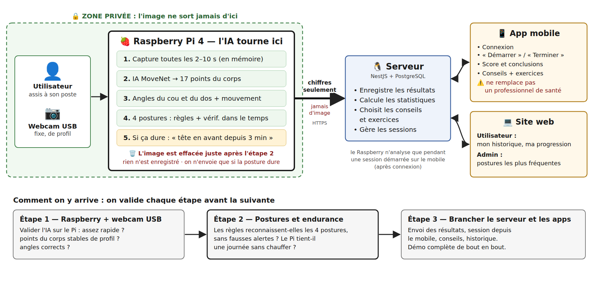

# Dos d'âne — Notre solution (MVP)

> Document court de référence pour le groupe et les encadrants.
> Le détail technique complet (sécurité, modèle de données, API, évolutions…) est dans l'[audit technique v3](Audit_technique_final_Fil_Rouge_Master_UHA_4_0_v3.md).

---

## 1. Le problème

Les personnes qui travaillent assises devant un ordinateur prennent de mauvaises postures sans s'en rendre compte : tête en avant, dos penché ou avachi, immobilité pendant des heures. Le sujet du fil rouge demande un système qui **détecte ces postures** et **propose des conseils et des exercices**, en **respectant la vie privée** et en précisant que l'application **ne remplace pas un professionnel de santé**.

**Notre problématique :**

> Peut-on détecter de façon fiable les mauvaises postures d'une personne assise à son poste, avec une caméra et un Raspberry Pi, **sans jamais envoyer ni stocker d'image** ?

---

## 2. Notre solution en une phrase

> **La caméra voit la personne, le Raspberry Pi transforme l'image en chiffres grâce à une IA, l'image est effacée, et seuls les résultats sont envoyés au serveur.**

---

## 3. Comment ça marche, côté utilisateur

1. J'arrive à mon poste et je me **connecte** à l'app mobile (email + mot de passe).
2. J'appuie sur **« Démarrer »** : la session commence. Le serveur relie mon compte au Raspberry du poste.
3. Je travaille normalement. Le **Raspberry Pi** regarde régulièrement : il capture une image, l'analyse et l'efface aussitôt. **Rien n'est enregistré.**
4. Le Raspberry envoie au serveur des **chiffres seulement** : l'état en direct (posture, score), un résumé toutes les 5 min, et une **alerte** seulement si une mauvaise posture **dure** plusieurs minutes (par exemple « tête en avant pendant 3 min ») ou si je reste immobile trop longtemps. L'alerte m'arrive en **notification** sur le téléphone.
5. Je termine la session : l'app affiche mon **score**, ce qui a été détecté, et des **conseils et exercices** adaptés.
6. Sur le **site web**, je retrouve mon historique. L'**administrateur** voit les postures les plus fréquentes, sans savoir qui est qui.

---

## 4. Comment le Raspberry analyse la posture

| Étape | Ce qui se passe | Outil |
|---|---|---|
| 1. Capture | une image de temps en temps (voir la cadence ci-dessous), gardée en mémoire seulement | webcam USB + OpenCV |
| 2. Squelette | l'IA repère **17 points du corps** (oreille, épaule, hanche…). La photo est ensuite **effacée**. | MoveNet (IA déjà entraînée par Google) |
| 3. Angles | on calcule des angles entre ces points | Python (NumPy) |
| 4. Règles | on compare les angles à des seuils : bonne ou mauvaise posture | nos règles |
| 5. Vérification dans le temps | on ne conclut qu'après plusieurs photos concordantes, pour éviter les fausses alertes | nos règles |

**L'IA ne « juge » pas la posture** : elle fournit uniquement les points du corps. C'est **notre logique** (angles + règles) qui décide si la posture est bonne.

### Capturer pour analyser ≠ enregistrer

Pour savoir si une posture est mauvaise, le Raspberry doit **regarder régulièrement**. Mais regarder ne veut pas dire enregistrer :

| | Quand | Ce qui reste |
|---|---|---|
| **Capturer + analyser** une image | régulièrement | **rien** : l'image est effacée juste après l'analyse |
| **Envoyer un résultat** | **seulement** quand une mauvaise posture est confirmée, ou en fin de session | des chiffres : type de posture, durée, angles |

### Cadence adaptative : capturer peu quand tout va bien

| Situation | Cadence de départ (ajustée par le test T7) |
|---|---|
| Posture correcte | 1 capture toutes les **10 s** |
| Posture douteuse | 1 capture toutes les **2 s**, pour confirmer vite |
| Mauvaise posture confirmée | on envoie l'événement, puis retour à 10 s |
| Personne au poste | 1 capture toutes les **30 s** |

Résultat : on capture beaucoup moins qu'avec une cadence fixe, sans détecter plus tard. C'est la **sobriété** demandée par le sujet.

### Les 4 postures du MVP

La caméra est placée **de profil**, car c'est la vue qui permet de voir la tête et le dos. Nous retenons les postures **qu'une caméra de profil mesure de façon fiable** :

| Posture | Ce qu'on mesure | Points utilisés |
|---|---|---|
| **Tête en avant** | l'angle entre l'épaule et l'oreille : plus la tête avance, plus l'angle change | oreille, épaule |
| **Dos penché en avant** | l'inclinaison du buste vers l'avant par rapport à la verticale | épaule, hanche |
| **Avachi, penché en arrière** | la même inclinaison du buste, mais vers l'arrière | épaule, hanche |
| **Immobilité prolongée** | les points du corps ne bougent presque pas pendant longtemps (par exemple 50 min), d'où une suggestion de pause | tous les points visibles |

Les **seuils de départ** viennent d'une méthode d'ergonomie reconnue (**RULA**, McAtamney & Corlett, 1993). Ils seront **ajustés par nos tests**.

**Pourquoi pas plus ?** Ce n'est pas une limite du sujet. Chaque posture ajoutée demande un angle, un seuil justifié et des tests. Certaines postures ne se voient pas de profil : épaules inclinées ou penché sur le côté (il faut une vue de face), jambes croisées (cachées par le bureau). Nous en ajouterons **une à la fois, une fois les précédentes validées** : d'abord le cou penché vers le bas (regarder son téléphone), puis la position des coudes. Ajouter une posture revient à ajouter une règle.

### Comment on évite les fausses alertes

- **Point mal détecté** (contre-jour, oreille cachée) : la photo est **ignorée**.
- **Mouvement bref** (boire, ramasser un stylo) : **pas d'alerte**. Il faut une mauvaise posture sur la majorité des photos pendant au moins 2 minutes.
- **Morphologie différente** d'une personne à l'autre : au début de la session, on enregistre la **posture de référence** de la personne (10 s assis droit).

---

## 5. Vie privée

- **Aucune image n'est envoyée ni stockée** : elle reste quelques millisecondes dans la mémoire du Raspberry.
- Le serveur ne reçoit que des **chiffres** : angles, score, type de posture, durée.
- Les données sont rattachées à un **pseudonyme**, jamais au nom de la personne.
- L'admin ne voit que des **statistiques globales**.
- Le Raspberry n'analyse que **pendant une session démarrée** par l'utilisateur, après connexion. Une seule session à la fois par Raspberry : si le poste est déjà utilisé, l'app affiche « poste occupé ».
- L'app et le site affichent : *« Cette application ne remplace pas un professionnel de santé. »*

---

## 6. Ce qui est dans le MVP, et ce qui n'y est pas

| Dans le MVP ✅ | Plus tard 🔜 |
|---|---|
| 1 webcam USB de profil + 1 Raspberry Pi 4 | 2ᵉ caméra (de face) |
| 4 postures : tête en avant, dos penché en avant, avachi en arrière, immobilité prolongée | cou penché vers le bas, coudes, puis postures vues de face (épaules inclinées…) |
| Cadence de capture adaptative | — |
| Détection par règles | IA de classification entraînée sur nos données |
| Serveur NestJS + base PostgreSQL | squelette animé en direct dans l'app |
| App mobile : connexion, bouton « Démarrer / Terminer », état en direct et score (SSE), alerte quand l'app est ouverte, conseils, exercices | notification push quand l'app est fermée (prioritaire) |
| Pi ↔ serveur : WebSocket (commandes, état en direct) + HTTPS (événements, résumés) | — |
| Session liée au seul Raspberry du MVP | plusieurs postes : poste attribué par l'admin, ou QR code à scanner si les postes sont partagés |
| Site web : historique + stats admin | outil d'annotation des données |
| Aucune image stockée ni envoyée | analyse d'une photo prise avec le téléphone |

---

## 7. Pourquoi ces choix

| Choix | Pourquoi | Alternative écartée |
|---|---|---|
| **IA sur le Raspberry**, pas sur le serveur | l'image ne quitte jamais le poste (RGPD) ; ça marche même si le réseau est coupé | envoyer les images au serveur : contraire à la vie privée |
| **Caméra** plutôt que capteurs portés (IMU) | rien à porter : on s'assoit et on travaille | IMU : obligent à porter un capteur sur soi |
| **MoveNet** (IA pré-entraînée) | léger, prévu pour les petits appareils | MediaPipe : **à comparer par un test** |
| **Caméra de profil** | c'est la seule vue où l'on voit la tête avancer et le dos se pencher | vue de face : ne voit pas ces postures |
| **Webcam USB** | branchée, elle marche ; **même code sur le PC et sur le Pi** ; câble long, facile à placer de profil | Arducam CSI (nappe courte, code différent) : **testée en alternative (T2)**. Le programme accepte les deux. |
| **Peu de captures, cadence adaptative** | une posture dure des minutes : inutile de filmer en continu. On capture plus souvent seulement en cas de doute (sobriété, demandée par le sujet). | flux vidéo : plus de calcul, plus de chaleur, aucun gain |
| **4 postures mesurables de profil** | mieux vaut peu de postures bien détectées que beaucoup mal détectées ; on en ajoute une fois les premières validées | viser toutes les postures dès le départ : impossible à valider |
| **NestJS + PostgreSQL** | un seul serveur pour le mobile, le web et le Raspberry | — |
| **WebSocket (Pi) + SSE (app) + HTTPS** | temps réel sans interroger le serveur en boucle ; le Pi ouvre lui-même la connexion (passe les pare-feu) ; ce qui est stocké passe en HTTPS avec renvoi si le réseau coupe | interroger le serveur toutes les secondes (polling) : lent et coûteux ; WebSocket aussi côté app : possible si l'équipe préfère une seule techno |

---

## 8. Ce qu'on doit encore prouver (tests)

Chaque choix est une **hypothèse** : on la teste avant de construire dessus. Si un test échoue, on applique le plan B.

| # | Question | Test | Réussi si… | Plan B |
|---|---|---|---|---|
| **T1** | L'IA tourne-t-elle sur le Raspberry Pi 4 ? | installer MoveNet et mesurer le temps par photo | < 150 ms par photo | autre version du moteur IA, photos moins fréquentes |
| **T2** | Quelle caméra sur le Pi : webcam USB ou Arducam CSI ? | 1 capture toutes les 5 s pendant 1 h avec chacune ; vérifier aussi la référence de l'Arducam (une Arducam ToF ne convient pas) | 0 échec ; points du corps aussi bien détectés | garder la caméra qui fonctionne |
| **T3** | MoveNet voit-il bien une personne assise de profil ? | 3 personnes, 3 éclairages, sur PC | oreille, épaule et hanche trouvées sur ≥ 90 % des photos | MediaPipe |
| **T4** | MoveNet ou MediaPipe ? | mêmes photos avec les deux IA | tableau comparatif → choix justifié | — |
| **T5** | Nos règles reconnaissent-elles les 4 postures ? | sessions « jouées » : chaque posture tenue 30 s, avec des gestes normaux au milieu ; immobilité simulée sur une durée raccourcie | ≥ 80 % de bonnes détections **par posture**, < 1 fausse alerte par heure | ajuster les seuils, référence personnelle ; retirer du MVP une posture qui échoue |
| **T6** | Aucune image ne sort-elle vraiment ? | capture du trafic réseau pendant 1 h | 0 image détectée | corriger avant la démo |
| **T7** | La cadence adaptative suffit-elle ? | rejouer T5 avec une cadence fixe (2 s) puis adaptative | même taux de détection, délai < 1 min, nettement moins de captures | ajuster les cadences |

**Ordre :** T1 et T2 tout de suite (si l'un échoue, tout le reste change), puis T3–T5 sur PC, puis T5–T7 sur le Raspberry.

---

## 9. Où on en est

| Fait | En cours / à faire |
|---|---|
| Analyse du sujet et des contraintes | **T1, T2** : installation de l'IA et de la caméra sur le Pi |
| Choix de l'architecture et audit technique | **T3, T4** : premiers tests MoveNet sur PC, webcam de profil |
| Squelette du code (serveur, site, app mobile, programme du Raspberry, déploiement automatique), sur une branche à fusionner | calcul des angles et premières règles |
| Schémas de la solution | envoi des résultats au serveur, puis app et site |

---

## 10. Petit glossaire

| Terme | Signification |
|---|---|
| **Edge / IA embarquée** | l'IA tourne sur l'appareil qui a la caméra (le Raspberry), pas sur un serveur distant |
| **Points du corps (keypoints)** | coordonnées (x, y) de 17 articulations repérées par l'IA : nez, oreilles, épaules, coudes, hanches… |
| **MoveNet / MediaPipe** | deux IA gratuites et déjà entraînées qui trouvent ces points sur une photo |
| **Session** | période pendant laquelle l'utilisateur accepte d'être analysé, de « Démarrer » à « Terminer » sur le mobile |
| **Pseudonyme** | identifiant du type `usr_34a71f` utilisé à la place du nom |
| **RULA** | méthode d'ergonomie qui donne des seuils d'angles pour évaluer une posture de travail |
| **Cadence adaptative** | le Raspberry capture rarement quand tout va bien, plus souvent quand il a un doute |
